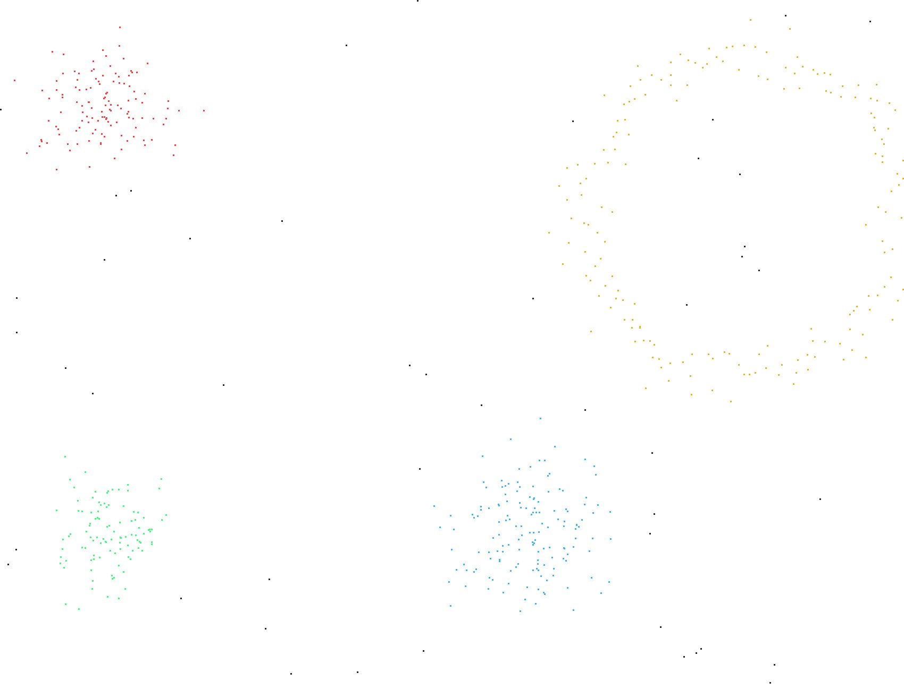

# DBSCAN 密度聚类 (Density-Based Clustering)

**日期**: 2026-08-13
**方向**: 算法 / 机器学习

## 技术点

DBSCAN 是一种基于密度的聚类算法，相比 k-means（06-21）和 GMM（06-23），它：

1. **无需预设簇数** — 自动发现簇的数量
2. **可识别任意形状** — 能捕捉环形等非凸结构
3. **天然处理噪声** — 将稀疏点标记为噪声而非强行归类

## 核心概念

- **核心点 (core point)**: Eps 邻域内至少包含 minPts 个点
- **边界点 (border point)**: 在核心点的 Eps 邻域内，但自身不是核心点
- **噪声点 (noise)**: 既非核心也非边界
- **密度可达 / 密度相连**: 通过核心点链传播簇标签

## 实现

- 暴力区域查询 O(n²)（数据集规模 610 点，足够）
- BFS 队列扩展簇
- **自动 eps 选择**：k-distance 图（第 minPts 近邻距离）的 88 百分位拐点

## 量化验证结果

| 指标 | 值 |
|------|-----|
| 总点数 | 610 |
| 自动 eps | 0.5997 (minPts=4) |
| 发现簇数 | 4 ✅（3 高斯 blob + 1 环形） |
| 噪声点数 | 47 (7.7%) |
| **Adjusted Rand Index** | **1.0000** |
| **Purity** | **0.9680** |
| 噪声检测 F1 | 0.7850 |

ARI=1.0 表示与 ground-truth 完全一致，正确识别了环形结构（k-means/GMM 无法做到）。

## 输出结果

（不同颜色代表不同簇，黑色点为检测出的噪声点）
