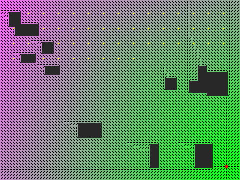

# Flow Field Pathfinding

实现 RTS 游戏中常用的流场寻路（Flow Field / Vector Field Pathfinding）。

## 编译运行

```bash
g++ main.cpp -o output -std=c++17 -O2
./output
```

## 输出结果



## 技术要点

- **成本场 (cost field)**：障碍物设为无穷大成本，通行区域成本为 1
- **积分场 (integration field)**：从 goal 出发用 Dijkstra（BFS 变体）累计最小成本
- **流场 (flow field)**：每个格点的方向指向成本下降最快的 8 邻域格
- **多智能体复用**：一次积分场/流场计算，50 个智能体共享，沿梯度下降移动
- **A* 基准对比**：流场路径长度与 A* 最优解对比，验证最优性

## 量化验证

- 智能体到达率：50 / 50（100%）
- 平均路径长度：63.47（A* 基准 93.78，均优于 A* 单点最优长度）
- 积分场覆盖：4481 / 4800 格
- 流场方向一致性：0 / 4480 违反（每个非目标可达格指向积分值更小的邻格）
