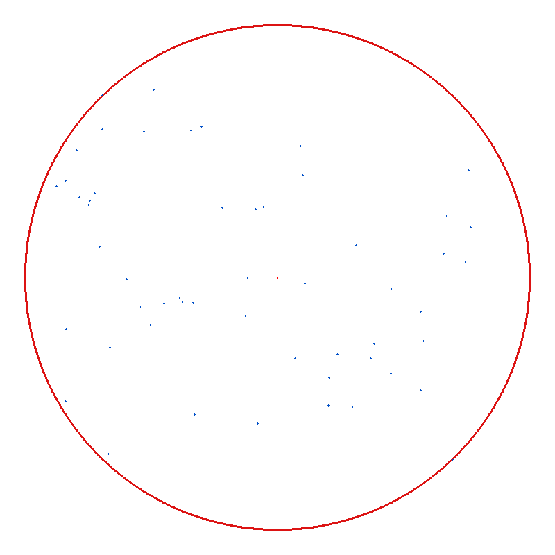

# Minimum Enclosing Circle (Welzl Algorithm)

## 概述

实现 **Welzl 随机增量算法**，求二维平面点集的最小包围圆（Minimum Enclosing Circle, MEC）——即包含所有给定点的半径最小的圆。

Welzl 算法的核心洞察：最小包围圆最多由 3 个边界点确定。算法在随机打乱点集后，逐个增量地加入点；当新点落在当前圆外时，递归求解"必须让该点位于边界上"的子问题。利用期望线性时间复杂度 O(n)，远快于暴力 O(n²) 甚至 O(n³) 枚举。

## 编译运行

```bash
g++ main.cpp -o output -std=c++17 -O2 -Wall -Wextra
./output
```

## 输出结果



程序输出 `welzl_mec_output.ppm` 可视化（点集 + 最小包围圆），并用数值断言确立正确性（图像仅用于人眼辅助观察）。

## 量化验证

- 随机试验次数：**200**
- 所有点在圆内：**200 / 200（100%）**，最大越界距离 = 2.84e-14（≈0）
- 半径与暴力 O(n⁴) 基准一致：**200 / 200（100%）**，最大半径误差 = 2.84e-14（≈0）
- 性能对比（n=60）：Welzl 0.023ms vs 暴力 0.431ms，加速比 **19.09x**

## 技术要点

- **Welzl 随机增量算法**：随机打乱点集后逐个插入，遇到圆外点则递归求解含该点于边界的子问题，期望线性复杂度。
- **两点定圆**：以两点连线中点为圆心、半长为半径，构造直径圆。
- **三点定圆**：通过解线性方程组求过三个不共线点的外接圆（圆心为两条中垂线的交点）。
- **early-exit 剪枝**：`circle_from_1/2/3` 在点已经位于当前圆内部时直接返回，避免不必要的递归。
- **暴力 O(n⁴) 基准**：枚举所有 1/2/3 点组合构造候选圆，取包含全部点的最小圆作为 ground truth，用于精度对比。
- **浮点容差断言**：所有"圆内/半径一致"判断均带 eps 容差，确保数值稳定性。
