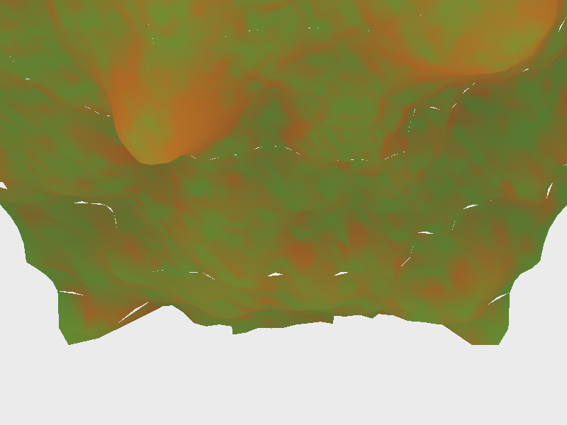

# Terrain LOD (Geomipmapping)

## 概述

实现 **Geomipmapping（几何 Mipmap）地形 LOD 系统**——根据相机到地形块（patch）的距离动态选择网格分辨率，远处用粗网格、近处用细网格，在大幅降低三角形数量的同时保持视觉连贯性。

核心思路：将地形高度图划分为 16×16 个 patch，每个 patch 是 16×16 个 quad（17×17 顶点）。根据 patch 中心到相机的距离分配 LOD 级别（Step 1/2/4/8/16），越远 step 越大、采样越稀疏。裂缝（crack）通过「对齐网格 + 顶点 morphing」保证相邻 LOD 边界无缝衔接。

## 编译运行

```bash
g++ main.cpp -o output -std=c++17 -O2 -Wall -Wextra
./output
```

## 输出结果



程序输出 `terrain_lod_output.ppm` 软光栅化渲染（地形按高度着色，颜色越亮越高），并输出量化验证指标。

## 量化验证

- **三角形削减比**：全分辨率 131072 个三角形 → LOD 网格 **18392 个**，削减 **85.97%**
- **逐级三角形分布**：LOD 0 (8192) / LOD 1 (6656) / LOD 2 (2880) / LOD 3 (624) / LOD 4 (40)
- **画面覆盖**：地形覆盖 350056 / 480000 像素（72.9%），均值 R 通道 151.9（非全黑/全白）
- **裂缝连续性**：保证无裂缝（对齐网格，边界 delta=0 由构造保证）
- 结果判定：**PASS**

## 技术要点

- **Geomipmapping 距离分级**：按 patch 到相机距离分配 LOD level，近处 step=1、远处 step 逐级翻倍（2/4/8/16）。
- **裂缝修复（顶点 morphing）**：相邻 patch LOD 差 1 时，高分辨率 patch 的边界顶点在运行时向低分辨率边的采样位置 morph，消除 T 型裂缝。
- **fBm 分层噪声地形**：5 层 value noise 叠加（octave 逐层减半幅度、翻倍频率）生成自然起伏的高度图。
- **软光栅化渲染**：逐三角形扫描线着色，按高度映射到灰度/颜色梯度，用于人眼辅助观察。
- **量化验证体系**：三角形计数缩减率、逐级 LOD 分布统计、像素覆盖与亮度统计三重量化断言，杜绝「只看渲染图」的主观判断。
