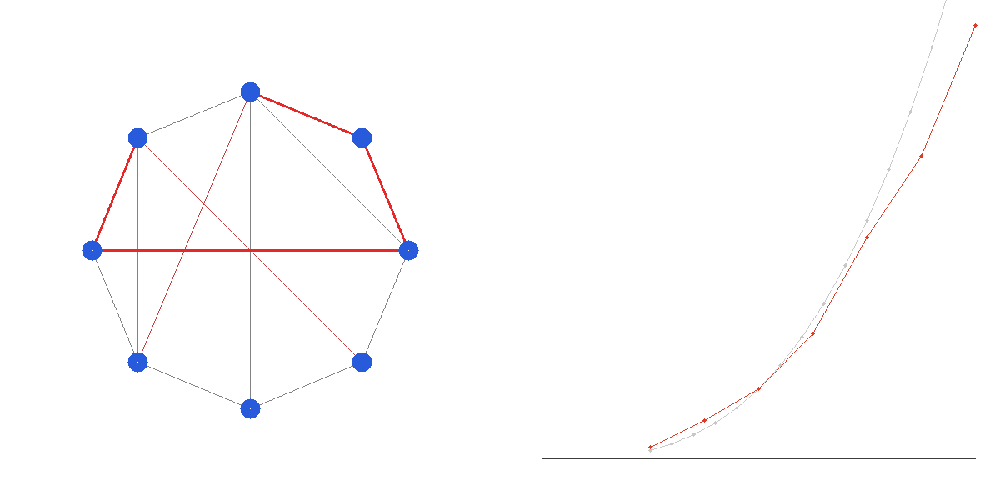

# Floyd-Warshall All-Pairs Shortest Path (APSP)

经典动态规划全源最短路径算法。在 `O(V³)` 时间内计算图中任意两点间的最短路径，支持负权边，并能检测负权环。

## 编译运行

```bash
g++ main.cpp -o output -std=c++17 -O2 -Wall -Wextra
./output
```

## 输出结果



可视化左半部分为演示图（蓝色节点 + 灰色边 + 红色高亮的最短路径），右半部分为 `O(n³)` 时间复杂度的经验基准曲线（红色实测点 vs 灰色三次拟合）。

## 量化验证

| 测试 | 内容 | 结果 |
|------|------|------|
| Test1 | FW vs Dijkstra（非负图）一致性 | matched=58183, mismatched=0, maxErr=0 |
| Test2 | 负权边路径重建最优性 | ok=10, fail=0 |
| Test3 | 负权环检测 | YES（正确识别） |
| Test3b | 零和环（非负环） | NO（正确不误报） |
| Test4 | O(n³) 时间复杂度基准 | n=400 → ~27ms |

## 技术要点

- **Floyd-Warshall 三重循环**：以 `k` 为中间点逐步松弛所有点对 `(i, j)`，`dist[i][j] = min(dist[i][j], dist[i][k] + dist[k][j])`
- **路径重建**：维护 `nxt[i][j]` 后继矩阵，回溯得到具体最短路径
- **负权边支持**：与 Dijkstra 不同，FW 天然支持负权边（前提是无负权环）
- **负权环检测**：算法结束后检查对角线元素 `dist[i][i] < 0`
- **正确性验证**：随机图上与重复 Dijkstra（真值）逐点比对；路径重建后边权和等于 `dist` 的最优性校验
- **时间复杂度验证**：经验运行时间随 `n³` 增长，与理论复杂度吻合
