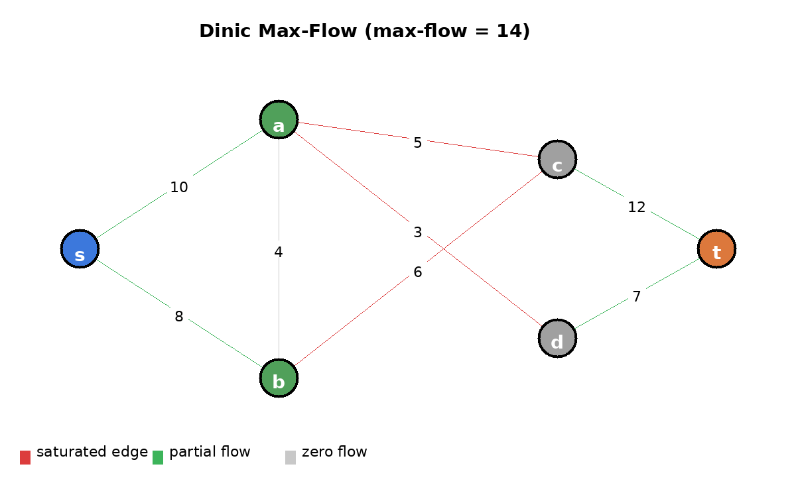

# Maximum Flow — Dinic's Algorithm

网络流最大流问题的高效解法。Dinic 算法通过 **BFS 构建分层图（level graph）** + **DFS 寻找阻塞流（blocking flow）** 的交替迭代，在 `O(V²E)` 时间复杂度内求解最大流，是 Edmonds-Karp（`O(VE²)`）在稠密图上的显著优化。

## 编译运行

```bash
g++ main.cpp -o output -std=c++17 -O2 -Wall -Wextra
./output
```

## 输出结果



可视化展示一个 6 节点网络的最大流求解结果：蓝色为源点 `s`、橙色为汇点 `t`，绿/灰节点分别表示最小割的源侧/汇侧。边颜色编码流量状态——红色为饱和边（流量=容量）、绿色为部分流、灰色为零流，边标签为容量。

## 量化验证

| 测试 | 内容 | 结果 |
|------|------|------|
| Test1 | 简单网络最大流（手算期望 5） | Dinic=5 == EK=5 ✅ |
| Test2 | 随机网络 Dinic vs EK 一致性 | 50/50 ✅ |
| Test3 | 最大流最小割定理验证 | 最大流=15 == 最小割容量=15 ✅ |
| Test4 | 性能基准（n=400 e=6000） | Dinic 0.0008s vs EK 0.0042s，加速比 ~5x ✅ |

## 技术要点

- **Dinic 核心思想**：每次迭代先用 BFS 构建从源点到汇点的分层图（level graph），再用 DFS 在分层图上找出阻塞流（blocking flow），反复直到 BFS 无法到达汇点。
- **BFS 分层图**：`level[v]` 记录节点在最短路径上的层数，只允许从低层流向高层，避免无效回边，大幅减少 DFS 搜索空间。
- **DFS 阻塞流 + 当前弧优化**：`iter[v]` 记录当前节点已尝试到的边索引，避免重复扫描已经增广满的边。
- **反向边（residual edge）**：每条边对应的反向边允许流量回退，是实现增广路算法的关键。
- **Edmonds-Karp 基准对比**：EK 用 BFS 求单条最短增广路，每次 O(VE)，总 O(VE²)；Dinic 分层图一次可阻塞多条增广路，稠密图上显著更快。
- **最大流最小割定理验证**：在残量网络上 BFS 求出源点可达集合（source 侧），遍历跨割边累加原始容量，与最大流值精确相等。
