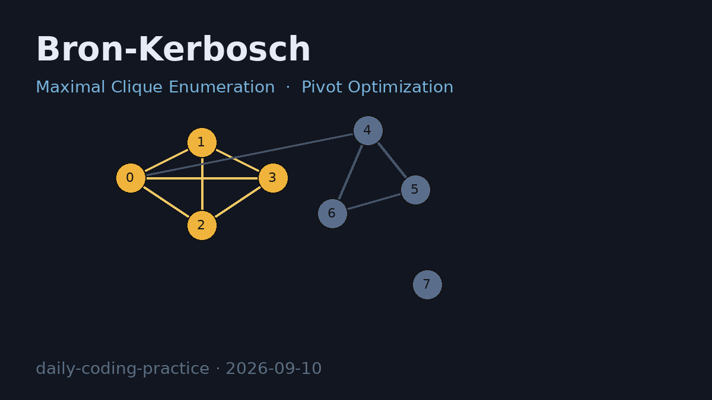

# Bron-Kerbosch Maximal Clique Enumeration

枚举无向图中所有的**极大团**（maximal clique），并通过暴力子集枚举基准验证正确性。

## 编译运行

```bash
g++ main.cpp -o bk -std=c++17 -O2 -Wall -Wextra
./bk
```

## 输出结果

输出为文本 `bk_output.txt`（控制台与文件一致），包含 3 个实现版本在 9 组测试图上的对比：

- **BK basic** —— 朴素 Bron–Kerbosch（无枢轴）
- **BK pivot** —— 带 Pivot 的 Tomita 退化解（显著减少递归节点数）



## 技术要点

- **Bron–Kerbosch 算法**：用集合 R（当前团）、P（候选点）、X（已排除点）递归枚举极大团
- **Pivot 优化**：选取 `P ∪ X` 中邻接度最大的点作枢轴，将搜索范围收缩到 `P \ N(pivot)`
- **正确性定量验证**：极大团数量、最大团大小、团有效性（两两相连 + 极大性）均与暴力 `O(2^N)` 基准一致
- **复杂度对比**：9 组测试图（n=3~16）中 pivot 版显著减少递归节点数（如 random_n12 从 144 → 28）

## 验证结果

9 组测试全部 ✅ PASS，总极大团数 basic=94 pivot=94，与暴力基准完全一致。
