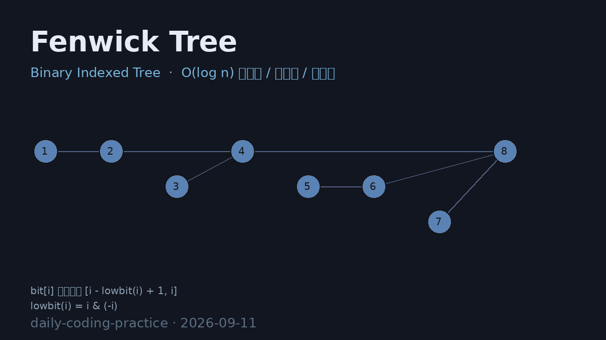

# Fenwick Tree (Binary Indexed Tree)

树状数组（Fenwick Tree / BIT）实现，支持 **O(log n) 点更新、前缀和、区间查询与逆序对计数**，并通过暴力 `O(n²)` 基准验证正确性。

## 编译运行

```bash
g++ fenwick.cpp -o fenwick -std=c++17 -O2 -Wall -Wextra
./fenwick > fenwick_output.txt
```

## 输出结果

输出为文本 `fenwick_output.txt`，包含三组测试：

- **Test1** —— 点更新 / 前缀和 / 区间查询，20000 次随机操作与暴力前缀数组逐项比对（失配数 = 0）
- **Test2** —— 逆序对计数 BIT 与暴力一致（N=5000）
- **Test3** —— 性能基准，BIT (N=200000) vs 暴力 (N=20000)，外推加速比约 1059x



## 技术要点

- **lowbit 技巧**：`i & (-i)` 取出最低位 1，用于定位父节点（`i + lowbit`）和前驱（`i - lowbit`）
- **点更新 add(idx, delta)**：沿父链向上传播，`idx += lowbit(idx)`，O(log n)
- **前缀和 prefix(idx)**：沿前驱链向下累加，`idx -= lowbit(idx)`，O(log n)
- **区间和 range(l, r)**：`prefix(r) - prefix(l-1)`，两次前缀和作差
- **逆序对计数**：坐标压缩 + 从右往左扫描，`rank` 之前已出现的元素个数累加即逆序对
- **正确性定量验证**：与暴力前缀数组 / 暴力逆序对基准逐项一致
- **复杂度对比**：BIT `O(n log n)` vs 暴力 `O(n²)`，实测外推加速比约 1059x

## 验证结果

Test1 / Test2 全部 ✅ PASS，BIT 与暴力基准结果完全一致。
