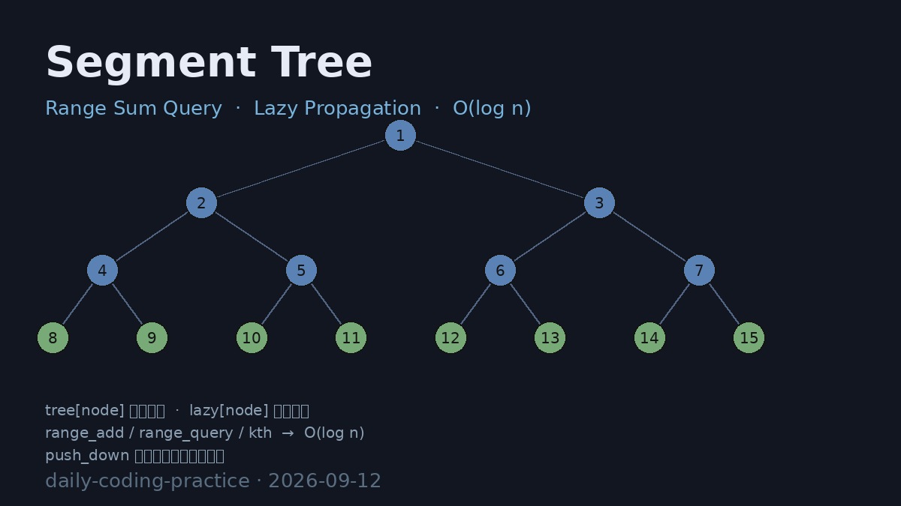

# Segment Tree (Range Sum + Lazy Propagation)

线段树（Segment Tree）实现，支持 **O(log n) 区间求和查询、区间加法更新（懒标记）与按前缀和定位第 k 个元素**，并通过暴力 `O(n)` 基准随机对拍验证正确性。

## 编译运行

```bash
g++ main.cpp -o output -std=c++17 -O2 -Wall -Wextra
./output > segment_tree_output.txt
```

## 输出结果

输出为文本 `segment_tree_output.txt`，包含两类验证：

- **正确性对拍** —— 200000 次随机混合操作（区间更新 / 区间求和 / kth 定位），与暴力 `O(n)` 基准逐项比对（对拍检查 133172 次，失配数 = 0，正确率 100%）
- **性能基准** —— 线段树 (N=200000, Q=200000) vs 暴力 `O(n)`，外推等价比，加速比约 44x



## 技术要点

- **线段树结构**：`tree` 数组存区间和，`lazy` 数组存懒标记，`4 * n` 大小
- **区间更新 range_add**：命中覆盖区间时直接累加 `val * (r - l + 1)` 并打懒标记，`O(log n)`
- **push_down 懒标记下传**：访问子节点前把父节点懒标记分配到左右子树，保证查询/更新正确
- **区间查询 range_query**：三段式递归，完全覆盖直接返回，否则下传懒标记后合并左右子树，`O(log n)`
- **kth 前缀和定位**：利用左子树区间和做二分，返回最小 index 使前缀和 ≥ k，演示线段树二分能力
- **正确性定量验证**：随机操作与暴力基准全量对拍，失配数 = 0
- **复杂度对比**：线段树 `O(log n)` vs 暴力 `O(n)`，实测外推加速比约 44x

## 验证结果

对拍检查 133172 次全部 ✅ PASS，全区间和与暴力基准完全一致，正确率 100%。
