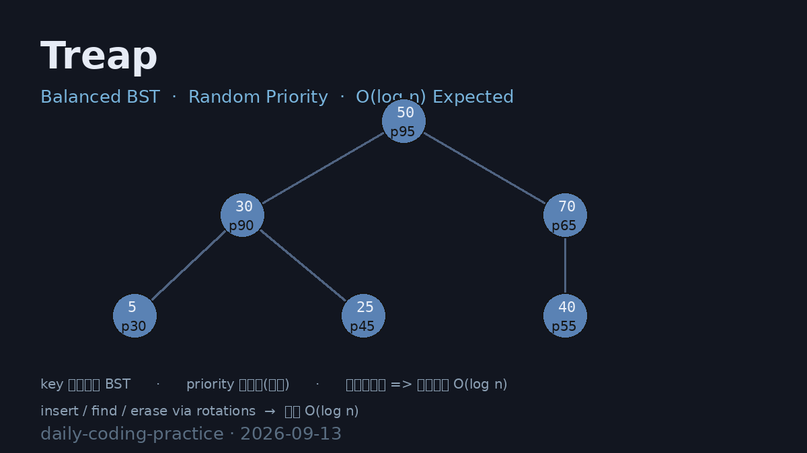

# Treap Balanced BST (Random Priority)

树堆（Treap）实现 —— 用**随机优先级**同时满足 **BST（按 key）** 与 **大顶堆（按 priority）** 两条性质，通过旋转在期望 `O(log n)` 时间内完成插入 / 查找 / 删除。核心优势：无需再平衡的复杂逻辑（不像 AVL/红黑树需要维护平衡因子），仅靠随机化即可规避朴素二叉搜索树顺序插入时退化为链表的最坏情况。

## 编译运行

```bash
g++ main.cpp -o output -std=c++17 -O2 -Wall -Wextra
./output > treap_output.txt
```

## 输出结果

输出为文本 `treap_output.txt`，包含四类量化验证：

- **Test1 正确性** —— 400000 次随机混合操作（insert/delete/find）与 `std::set` 全量对拍，查找失配数 = 0，最终排序序列完全一致，BST + 堆性质全程保持
- **Test2 高度平衡** —— 规模从 1000 到 1000000，树高恒为对数级（最大 50 vs 退化上界 1000000）
- **Test3 性能** —— 随机 100 万次操作与 `std::set` 同一量级
- **Test4 顺序插入压力** —— 100000 个单调递增键仅产生高度 43（退化链表应为 100000）



## 技术要点

- **Treap 本质**：每个节点携带随机 `priority`，key 满足 BST、priority 满足大顶堆，两者唯一确定一棵树
- **旋转维护**：插入后若子节点 priority 大于父节点则旋转（左旋 / 右旋），`O(1)` 恢复堆性质
- **删除 = merge**：通过合并左右子树实现 erase，避免传统删除的三种情况分类
- **随机化均衡**：随机 priority 使树形状等价于按随机顺序插入的普通 BST，期望高度约 `4.3 log2 n`
- **量化验证**：与 `std::set` 对拍 0 失配 + 高度对数级验证 + 顺序数据抗退化验证

## 验证结果

四项量化验证全部 ✅ PASS（详见 `treap_output.txt`），正确率 100%，无退化，性能量级与 `std::set` 相当。
