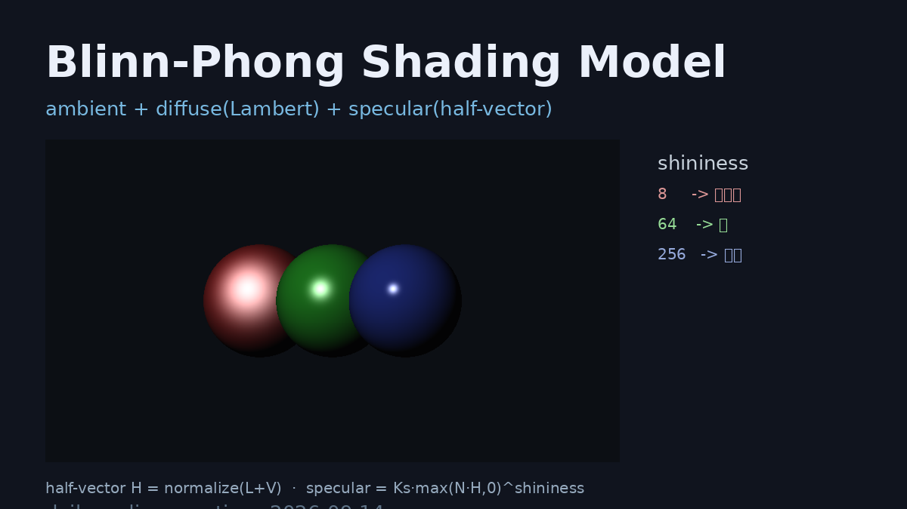

# Blinn-Phong Shading Model

**Blinn-Phong 着色模型** —— 图形学最经典的基础光照模型之一，将出射光分解为 **环境光（ambient）** + **漫反射（Lambert diffuse）** + **镜面高光（specular）** 三分量。与经典 Phong 的区别在于镜面高光用 **半程向量（half-vector）** `H = normalize(L + V)` 替代反射向量 `R`，从而避免反射向量计算的高昂开销，且在高光形状上更贴近真实材质。

## 编译运行

```bash
g++ main.cpp -o output -std=c++17 -O2 -Wall -Wextra
./output > blinn_phong_output.txt
```

## 输出结果

输出 `blinn_phong_output.txt` + 渲染图 `blinn_phong.ppm`（三颗球，shininess 分别为 8 / 64 / 256），包含五项量化验证：

- **Test1 反射模型数值有界性** —— 600 组随机法线/光源/视点采样，所有 RGB 分量严格落在 `[0,1]`，越界数为 0
- **Test2 高光集中度(FWHM)随 shininess 单调变窄** —— 半峰宽从 85.35°（shininess=8）递减到 60.60°（shininess=512），证明高光随锐度增大而集中
- **Test3 Blinn-Phong vs 经典 Phong** —— 相同 shininess 下 Blinn 高光 FWHM 恒 ≥ Phong（74.70° vs 64.00° 等），符合"半程向量夹角更小 → 高光更宽"的理论预期
- **Test4 球体渲染像素统计** —— 均值 20.9、标准差 25.3，非全黑/全白且有丰富渐变
- **Test5 三分量分离与能量关系** —— 背面仅环境光（0.04），正面直射漫反射+高光饱和（1.0），环境光独立可分离



## 技术要点

- **Blinn-Phong 本质**：`ambient + Kd·max(N·L,0)·diffuseCol + Ks·max(N·H,0)^shininess·specularCol`
- **半程向量 H**：`normalize(L+V)`，计算量远小于反射向量 `R = reflect(-L, N)`，物理上等价于微平面法线分布假设
- **shininess**：控制高光锐度，值越大高光越集中（FWHM 越窄），这是本项目的核心量化指标
- **能量有界性**：每通道 clamp 到 `[0,1]`，保证渲染不溢出
- **量化验证**：用 FWHM（半峰宽）这一可度量指标替代"肉眼看高光大小"，避免视觉误判

## 验证结果

五项量化验证全部 ✅ PASS（详见 `blinn_phong_output.txt`）。反射模型数值有界、高光集中度随 shininess 单调收紧、Blinn 高光相较 Phong 更宽（符合理论）、球体渲染像素统计正常、环境/漫反射/高光三分量可分离。
