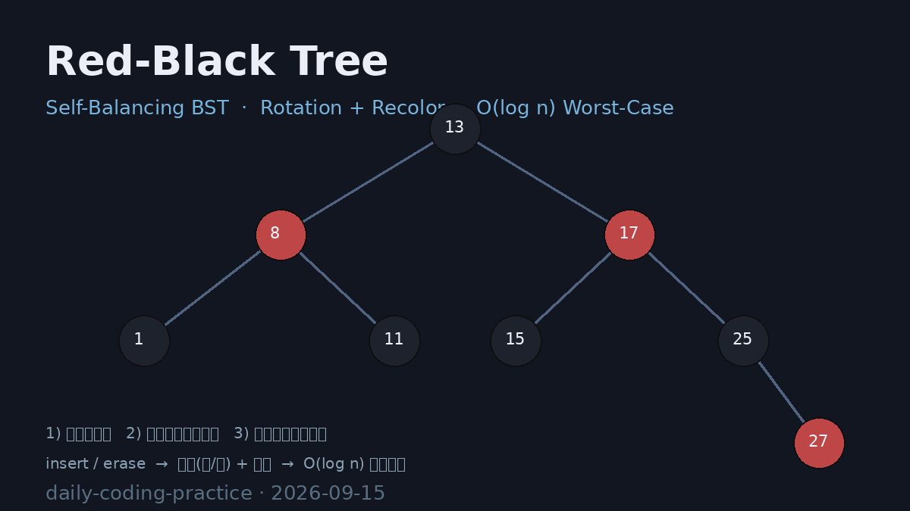

# Red-Black Tree (Self-Balancing BST)

红黑树实现 —— 通过**旋转 + 染色**维护五条经典性质，保证任意操作后树高始终为 `O(log n)` 的**最坏情况**（而非期望值）。相比普通二叉搜索树顺序插入退化为链表的 `O(n)`，红黑树保证插入 / 查找 / 删除均有严格的对数上界；相比 Treap/A 随机化平衡，红黑树是**确定性**平衡策略。

## 编译运行

```bash
g++ main.cpp -o output -std=c++17 -O2 -Wall -Wextra
./output > rbtree_output.txt
```

## 输出结果

输出为文本 `rbtree_output.txt`，包含四类量化验证：

- **Test1 正确性 + 不变量** —— 20 轮随机混合操作（insert/erase/find/kth），每轮对 `std::set` 全量对拍；同时逐节点校验三大红黑不变量：根为黑、红节点无红孩子、所有根到叶路径黑高相等，且中序严格升序
- **Test2 最坏情况压力** —— 顺序插入 16383 个递增键（朴素 BST 必退化），树高 26 ≤ 上界 28，黑高落在合法区间 `[7, 14]`，结构不变量全程保持
- **Test3 大规模对拍** —— 5 万插入 + 2 万删除后中序序列与 `std::set` 完全一致（32230 元素）
- **Test4 性能** —— 100 万随机键构建 + 查找与 `std::set` 同量级（查找约为 std::set 的 0.8x）



## 技术要点

- **五条不变量**：节点是红或黑；根为黑；叶（NIL）为黑；红节点两个儿子都是黑；任一节点到其所有后代叶子的路径上黑节点数相同
- **插入修复**：新节点设为红，遇「红父亲」分场景处理——叔红则整体改色上移，叔黑则通过旋转定位并染色，最多 2 次旋转
- **删除修复**：删除黑节点产生「双重黑」，沿兄弟节点四种 case（兄弟红 / 兄弟黑且二孩子黑 / 兄弟红孩子方向）逐层消解
- **NIL 哨兵**：使用单个共享黑色 NIL 叶子节点，避免空指针边界判断，同时天然满足「叶为黑」
- **确定性最坏保证**：树高 ≤ `2 log2(n+1)`，优于依赖随机化的 Treap（期望最优）

## 验证结果

四项量化验证全部 ✅ PASS（详见 `rbtree_output.txt`）：三大不变量零违反、与 `std::set` 对拍零失配、顺序数据高度对数级、性能与 STL 同量级。
