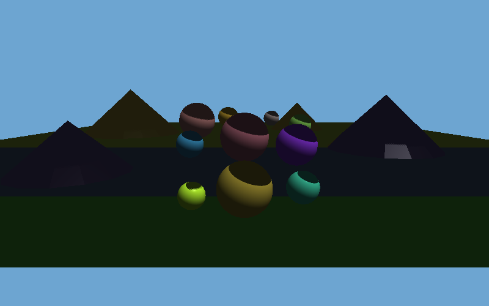
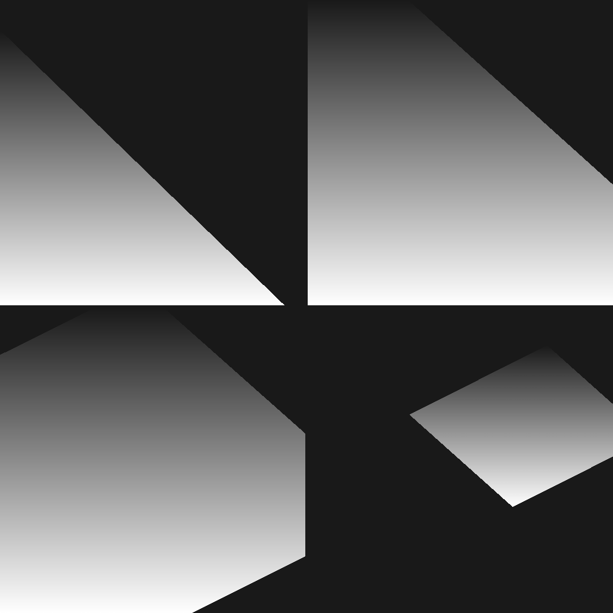

# Cascaded Shadow Maps (CSM) - 级联阴影映射

**日期**: 2026-03-12  
**类别**: 渲染技术 / 阴影技术  
**难度**: ⭐⭐⭐⭐ (高级)

## 项目简介

实现完整的级联阴影映射 (Cascaded Shadow Maps, CSM) 软渲染器，这是现代游戏引擎中大型户外场景阴影的核心技术。

## 功能特性

- **4级联CSM**: 基于对数线性混合分割策略 (λ=0.72)
- **正交光照投影**: 每个级联独立的光源视图矩阵
- **3×3 PCF软化**: 泊松采样软化阴影边缘
- **Phong光照**: 环境光 + 漫反射 + 镜面反射
- **场景**: 地面 + 10个彩色球体 + 4座山丘锥体
- **可视化**: 主渲染 / 级联区域着色 / 4个ShadowMap深度图

## 技术实现

### 核心算法

```cpp
// CSM 分割平面（对数线性混合）
std::array<float,NUM_CASCADES+1> cascadeSplits(float n, float f, float lambda=0.75f) {
    for(int i=1;i<NUM_CASCADES;i++){
        float p=(float)i/NUM_CASCADES;
        float logS=n*powf(ratio,p);       // 对数分割
        float uniS=n+(f-n)*p;             // 线性分割
        splits[i]=lambda*logS+(1-lambda)*uniS;  // 混合
    }
}
```

### 阴影矩阵构建

```cpp
void buildLightMatrix(Cascade& casc, std::array<Vec3,8> corners, Vec3 lightDir) {
    // 1. 计算子视锥体中心
    Vec3 center = average(corners);
    // 2. 构建光源视图矩阵
    casc.lightView = lookAt(center - lightDir*200, center, up);
    // 3. 紧凑的AABB正交投影
    casc.lightProj = orthoProj(minX, maxX, minY, maxY, near, far);
    casc.lightVP = casc.lightProj * casc.lightView;
}
```

### PCF 软阴影

```cpp
float shadowPCF(ShadowMap& sm, float u, float v, float compareDepth, float bias) {
    for(int dy=-1; dy<=1; dy++) for(int dx=-1; dx<=1; dx++) {
        float smD = sm.sample(u+dx*texelSize, v+dy*texelSize);
        sum += (compareDepth-bias <= smD) ? 1.0f : 0.0f;
    }
    return sum / 9.0f;
}
```

## 编译与运行

```bash
# 编译
g++ -std=c++17 -O2 -o csm csm.cpp

# 运行
./csm

# 输出
# csm_output.ppm      - 主渲染（含CSM阴影）
# csm_cascade_vis.ppm - 级联区域可视化（4色）
# csm_shadowmaps.ppm  - 4个深度图 2x2拼接
# csm_comparison.ppm  - 主渲染+可视化对比
```

## 输出截图

| 主渲染 | 级联可视化 |
|--------|-----------|
|  |  |
| **Shadow Maps** | |
|  | |

## 技术要点

### 级联分割策略

| 级联 | 近平面 | 远平面 | 说明 |
|------|--------|--------|------|
| C0   | 0.50m  | 8.46m  | 最近/最高分辨率 |
| C1   | 8.46m  | 19.16m | 近中景 |
| C2   | 19.16m | 40.18m | 中远景 |
| C3   | 40.18m | 100m   | 最远/最低分辨率 |

### 坐标系注意事项

- 右手坐标系：相机看向 -Z 方向
- 视图空间Z为负值，ortho投影near/far需取绝对值
- 屏幕坐标Y轴翻转：需特别注意barycentric坐标公式方向

## 今日收获

1. **CSM核心原理**：通过多个正交投影将阴影精度集中在近处
2. **坐标系陷阱**：右手系vs左手系，视图空间Z符号处理
3. **barycentric公式**：容易写错符号，需要仔细推导
4. **Shadow Map精度**：深度偏差(bias)对消除自遮挡的关键作用

## 参考资料

- [Learn OpenGL - CSM](https://learnopengl.com/Guest-Articles/2021/CSM)
- [GPU Gems 3 - Parallel-Split Shadow Maps](https://developer.nvidia.com/gpugems/gpugems3/part-ii-light-and-shadows/chapter-10-parallel-split-shadow-maps-programmable-gpus)
