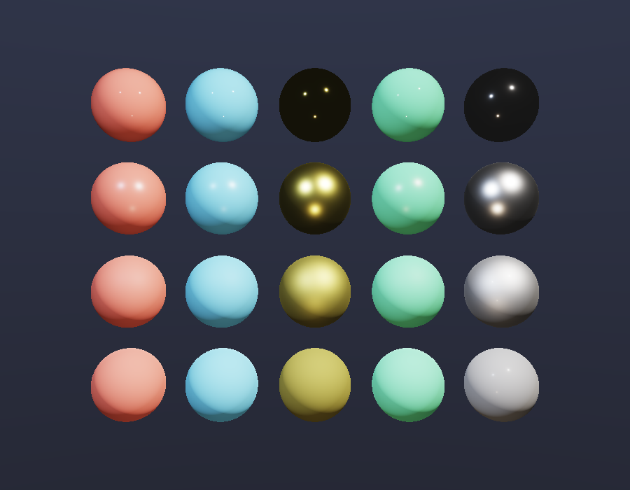

# Disney Principled BRDF Renderer

实现迪士尼原则性 BRDF（Burley 2012），渲染 5×4 材质球阵列，展示不同材质参数组合的视觉效果。

## 编译运行
```bash
g++ main.cpp -o output -std=c++17 -O2 -Wall -Wextra
./output
```

## 输出结果


## 技术要点
- Disney Principled BRDF 全参数实现（baseColor, metallic, roughness, specular, specularTint, anisotropic, sheen, clearcoat, subsurface）
- GGX 微表面 NDF (GTR2)
- Smith 几何遮蔽函数
- Schlick Fresnel 近似
- Clearcoat 层（GTR1 NDF）
- Hanrahan-Krueger 次表面散射近似
- ACES Filmic 色调映射 + Gamma 校正
- 多光源照明系统（主光、补光、底光）
