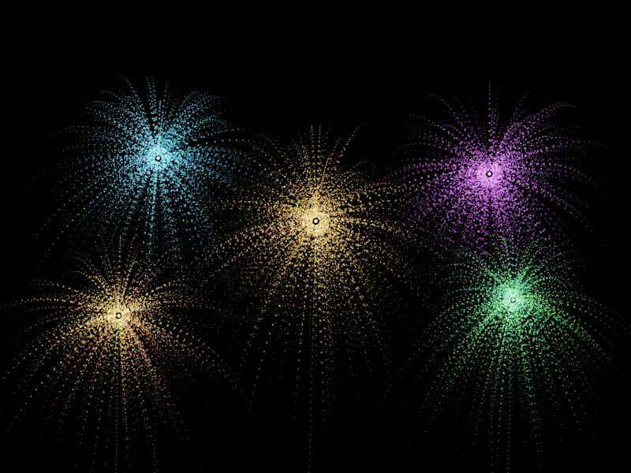

# Particle System Simulation — 烟花粒子系统

## 编译运行
```bash
g++ main.cpp -o output -std=c++17 -O2
./output
```

## 输出结果


## 技术要点
- **粒子发射器**：每次爆炸生成 400~600 个粒子，随机初速度方向分布（全向爆炸）
- **物理模拟**：重力加速度 + 线性阻力（drag），模拟真实烟花粒子下落与减速
- **时序帧合成**：多时间步渲染结果叠加到单张图，呈现运动轨迹
- **HDR 渲染 + Reinhard 色调映射**：粒子亮度使用 HDR 数值，最终 tonemapping + Gamma 校正
- **软光栅 Splat**：每个粒子以 Gaussian 衰减的圆形笔刷绘制，避免锯齿
- **HSV 颜色系统**：每次爆炸分配不同 Hue，粒子颜色随寿命线性衰减
- **发射轨迹**：每颗烟花从底部绘制上升轨迹，模拟发射阶段
