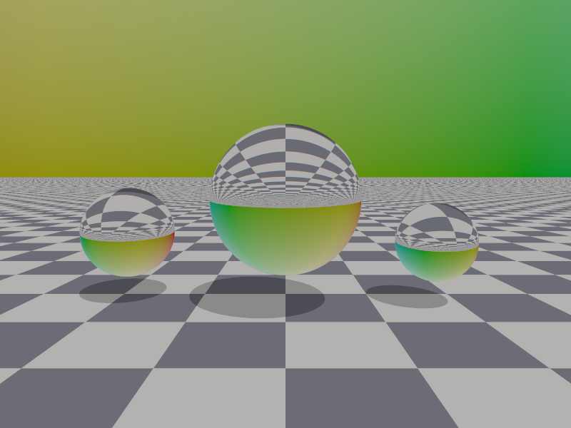
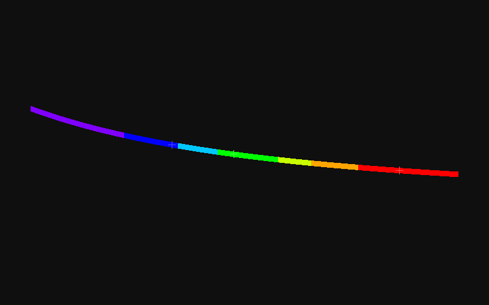

# Spectral Dispersion Ray Tracer

**光谱色散光线追踪器** - 使用柯西方程模拟玻璃的波长依赖折射率，实现彩虹色散效果。

## 技术原理

- **柯西方程**: `n(λ) = A + B/λ²`（Crown Glass BK7: A=1.5046, B=0.00420）
- **三通道追踪**: R(656nm)、G(532nm)、B(486nm) 分别用不同折射率追踪光线
- **Fresnel反射**: Schlick近似，决定折射/全反射比例
- **彩虹天空盒**: 方向依赖的彩色背景，放大色散视觉效果
- **Reinhard色调映射 + Gamma2.2校正**

## 折射率数据

| 波长 | λ (μm) | IOR n |
|------|--------|-------|
| Red  | 0.656  | 1.5144 |
| Green| 0.532  | 1.5194 |
| Blue | 0.486  | 1.5224 |
| Δn(B-R) | — | 0.0080 |
| Abbe数 V_d | — | 64.4 |

## 编译运行

```bash
g++ main.cpp -o output -std=c++17 -O2 -Wall -Wextra
./output
# 渲染约2秒，800x600, 16spp
```

## 输出结果

| 色散版 | 无色散对比 | IOR曲线 |
|--------|-----------|---------|
|  |  |  |

## 文件说明

- `main.cpp` — 全部源代码（约400行）
- `spectral_dispersion_output.png` — 色散渲染主图（800×600）
- `spectral_no_dispersion.png` — 无色散对比图（800×600）
- `spectral_ior_curve.png` — IOR vs 波长可视化曲线

**Date**: 2026-04-13 | **Compile**: g++ -std=c++17 -O2 | **Runtime**: ~2s
