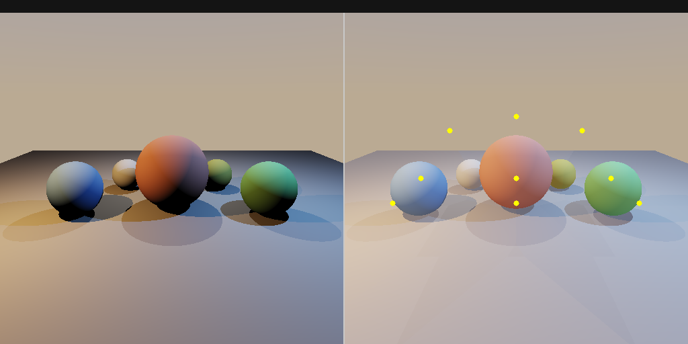

# Ambient Light Probes & Irradiance Caching

游戏引擎 GI（全局光照）系统核心技术：光探针 + 球谐辐照度缓存 + 探针插值渲染。

## 编译运行

```bash
g++ main.cpp -o output -std=c++17 -O2
./output
```

## 输出结果



左半边：仅直接光照  
右半边：直接光照 + 光探针 GI（间接漫反射）  
黄色圆点：光探针位置

## 技术要点

- **SH2 球谐函数** (Ramamoorthi & Hanrahan 2001)：9 系数/通道编码辐照度
- **蒙特卡洛探针烘焙**：每探针 2048 样本采样全方向辐射
- **余弦叶片卷积**：SH 系数与余弦核的精确卷积（ A_l 加权）
- **距离倒数加权插值**：渲染时取最近 4 个探针，距离倒数插值辐照度
- **场景**：3 球体 + 地面 + 2 发光球光源，双侧对比渲染
