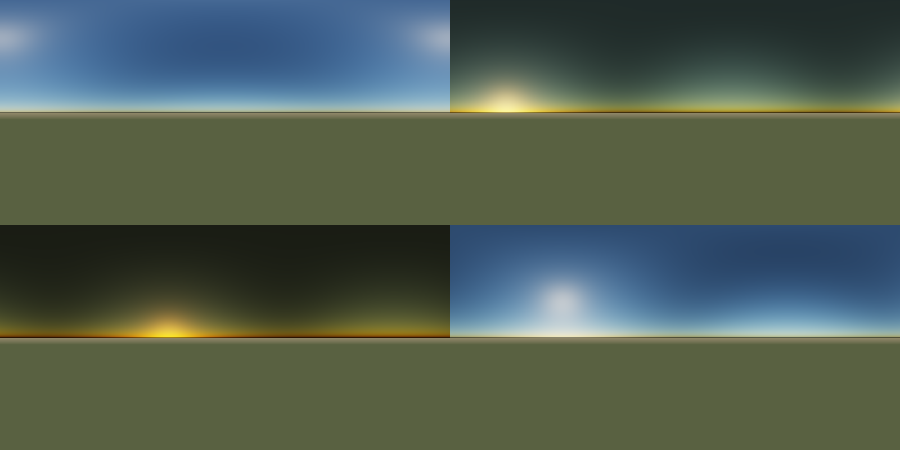

# Atmospheric Scattering Sky Renderer

基于物理的大气散射天空渲染器，实现 Rayleigh + Mie 散射模型，渲染多时段天空效果。

## 编译运行

```bash
g++ main.cpp -o output -std=c++17 -O2
./output
```

## 输出结果



2x2 网格，分别展示：正午（蓝天）、日落（橙红天际）、黎明（浅色天空）、早晨（金色调）。

## 技术要点

- **Rayleigh 散射**：波长依赖散射（λ⁻⁴），解释蓝天和日落橙红色
- **Mie 散射**：波长无关散射，产生太阳周围白色光晕
- **透射率积分**：沿视线和太阳光路积分光学深度
- **Henyey-Greenstein 相位函数**：参数化前向散射强度
- **ACES Filmic 色调映射**：HDR → LDR，保留细节
- **Equirectangular 投影**：渲染完整天穹

## 参数

| 参数 | 值 | 说明 |
|------|-----|------|
| 地球半径 Re | 6360 km | 物理值 |
| 大气层顶 Ra | 6420 km | 60km 大气厚度 |
| Rayleigh 标高 Hr | 7994 m | 散射衰减高度 |
| Mie 标高 Hm | 1200 m | 气溶胶浓度高度 |
| 太阳强度 | 20.0 | 归一化辐照度 |
| Mie g 参数 | 0.76 | 前向散射强度 |
