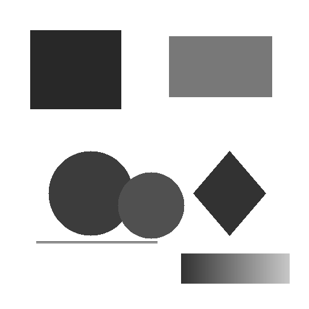
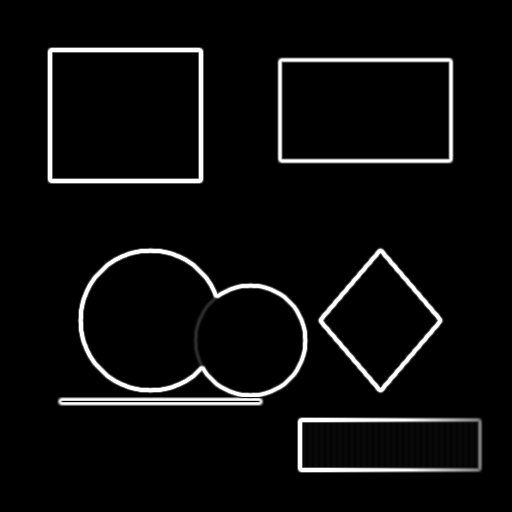
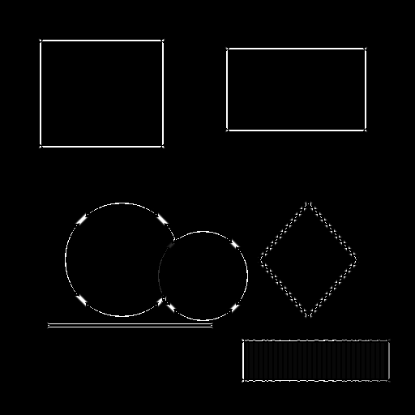
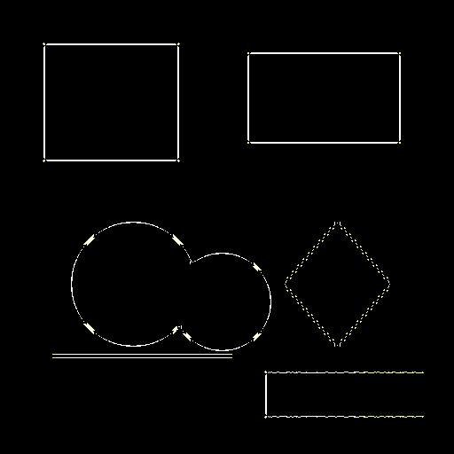
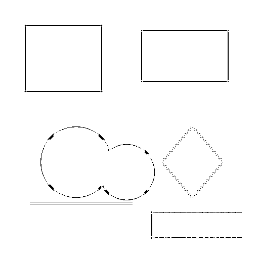
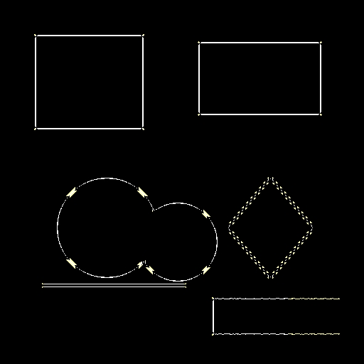
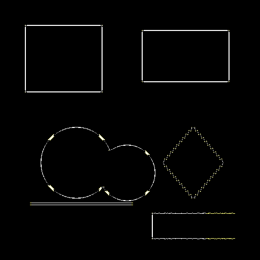

# Canny Edge Detection

## 编译运行
```bash
g++ main.cpp -o canny -std=c++17 -O2
./canny
```

## 输出结果

### 输入测试图


### 处理阶段
| 阶段 | 输出 |
|------|------|
| 高斯平滑 |  |
| 梯度计算 |  |
| 非极大值抑制 |  |

### 最终结果
 

### 参数对比
| 低阈值 | 默认 | 高阈值 |
|--------|------|--------|
|  |  |  |

## 技术要点
- **高斯平滑（5×5 kernel, σ=1.4）**：抑制噪声，为梯度计算做准备
- **Sobel 梯度计算（3×3）**：计算像素梯度的幅值和方向
- **非极大值抑制**：沿梯度方向保留局部最大值，实现边缘细化
- **双阈值（高低阈值 0.15/0.4 分位数）**：区分强边缘、弱边缘和噪声
- **滞后边缘追踪**：从强边缘出发，8邻域追踪连通弱边缘

## 量化验证结果
- 边缘密度：1.60%
- 平均梯度幅值：354.45
- 最大梯度幅值：470.43
- NMS 边缘减少率：75.4%
- 所有 6 项检查通过 ✅
