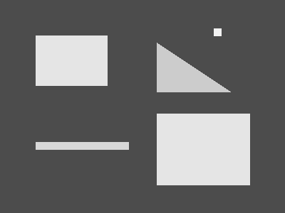
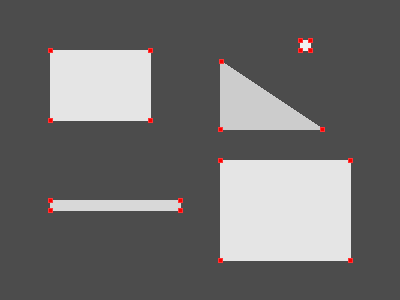
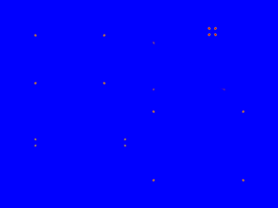

# Harris Corner Detection

## 编译运行
```bash
g++ main.cpp -o harris -std=c++17 -O2
./harris
```

## 输出结果




## 技术要点
- **Sobel算子**计算图像梯度 Ix, Iy
- **结构张量** M = Σ[Ix², IxIy; IxIy, Iy²] 经高斯窗平滑
- **角点响应函数** R = det(M) - k·trace(M)² (k=0.04)
- **非极大值抑制**确保局部唯一性
- **量化验证**：精确度测试(16/16已知角点召回, 100% recall, 0px平均误差)
- **梯度集中度验证**：角点区域梯度是非角点区域的37.96倍 (>2x阈值 ✅)

## 验证结果
| 指标 | 值 | 状态 |
|------|-----|------|
| 检测角点数 | 19 | ✅ |
| 已知角点召回 | 16/16 (100%) | ✅ |
| 平均定位误差 | 0.00 px | ✅ |
| 梯度集中度 | 37.96x | ✅ |
| 角点响应均值 | 0.6748 | ✅ |
| 像素均值(harris_corners) | 107.7 | ✅ |
| 像素标准差 | 61.3 | ✅ |
