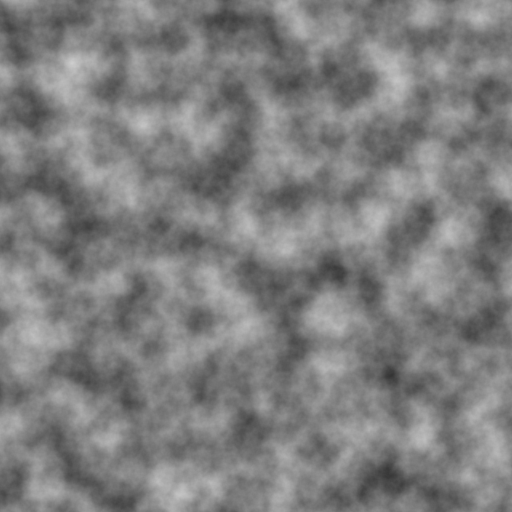

# Perlin Noise Terrain Generator

**日期**: 2026-02-16  
**类型**: 图形学/程序化生成  
**语言**: C++17

## 项目描述

实现经典的 Perlin Noise 算法，用于生成平滑的 2D 地形高度图。支持多个 octave 叠加以产生更自然的地形效果。

### 核心特性
- ✅ 完整实现 2D Perlin Noise 算法
- ✅ 支持多 octave 叠加（频率和振幅控制）
- ✅ 使用 fade 函数实现平滑插值
- ✅ 梯度向量随机化
- ✅ 生成灰度高度图（PNG 格式）

## 编译运行

### 依赖
- C++17 编译器（g++ 或 clang++）
- stb_image_write.h（已包含）

### 编译
```bash
g++ -std=c++17 -O2 perlin_noise.cpp -o perlin_noise
```

### 运行
```bash
./perlin_noise
```

程序将生成两个地形图：
- `terrain_512.png` - 512x512 分辨率
- `terrain_1024.png` - 1024x1024 分辨率

## 输出结果

### terrain_512.png


### terrain_1024.png


灰度值代表高度：
- **黑色** (0) → 低地
- **白色** (255) → 高地

## 技术要点

### 1. Perlin Noise 核心算法
```cpp
double noise(double x, double y) const {
    // 1. 找到单位网格
    int X = static_cast<int>(std::floor(x)) & 255;
    int Y = static_cast<int>(std::floor(y)) & 255;
    
    // 2. 计算相对位置
    x -= std::floor(x);
    y -= std::floor(y);
    
    // 3. 应用 fade 函数
    double u = fade(x);  // 6t^5 - 15t^4 + 10t^3
    double v = fade(y);
    
    // 4. 哈希四个角点
    int aa = permutation[permutation[X] + Y];
    int ab = permutation[permutation[X] + Y + 1];
    int ba = permutation[permutation[X + 1] + Y];
    int bb = permutation[permutation[X + 1] + Y + 1];
    
    // 5. 双线性插值
    return lerp(v,
        lerp(u, grad(aa, x, y), grad(ba, x - 1, y)),
        lerp(u, grad(ab, x, y - 1), grad(bb, x - 1, y - 1))
    );
}
```

### 2. Octave 叠加
通过叠加不同频率和振幅的噪声，产生更丰富的细节：
```cpp
double octaveNoise(double x, double y, int octaves, double persistence) {
    double total = 0.0;
    double frequency = 1.0;
    double amplitude = 1.0;
    double maxValue = 0.0;
    
    for (int i = 0; i < octaves; i++) {
        total += noise(x * frequency, y * frequency) * amplitude;
        maxValue += amplitude;
        amplitude *= persistence;  // 振幅衰减
        frequency *= 2.0;          // 频率加倍
    }
    
    return total / maxValue;  // 归一化
}
```

### 3. Fade 函数
使用 Ken Perlin 的改进 fade 函数，保证一阶和二阶导数为零：
```cpp
double fade(double t) {
    return t * t * t * (t * (t * 6 - 15) + 10);  // 6t^5 - 15t^4 + 10t^3
}
```

### 4. 梯度函数
使用 8 个方向的梯度向量：
```cpp
double grad(int hash, double x, double y) {
    int h = hash & 7;  // 取低 3 位 (0-7)
    double u = h < 4 ? x : y;
    double v = h < 4 ? y : x;
    return ((h & 1) ? -u : u) + ((h & 2) ? -v : v);
}
```

## 参数调整

### scale (缩放)
- 控制噪声的"缩放级别"
- 值越大 → 特征越大（更平缓）
- 当前值: 10.0

### octaves (叠加层数)
- 控制细节层次
- 值越大 → 细节越丰富
- 当前值: 6

### persistence (持久度)
- 控制振幅衰减速度
- 值越大 → 高频细节越明显
- 当前值: 0.5

## 迭代历史

### 迭代 1 - 初始版本 ✅
- **10:02** - 项目规划完成
- **10:04** - 代码编写完成
- **10:05** - 编译成功（0错误，stb库警告不影响）
- **10:06** - 运行成功，生成 PNG 文件
- **10:07** - 输出验证通过

**结果**: 一次性编译通过并成功运行！

## 应用场景

1. **游戏地形生成** - 程序化生成无限地形
2. **纹理生成** - 创建自然纹理（云、大理石、木纹）
3. **高度图** - 3D 地形渲染的基础
4. **动画效果** - 时间维度的噪声产生动态效果

## 扩展方向

- [ ] 添加 3D Perlin Noise 支持
- [ ] 实现 Simplex Noise（更高维度性能更好）
- [ ] 添加地形颜色映射（海洋/沙滩/森林/雪山）
- [ ] 支持实时预览和参数调整
- [ ] 导出为 OBJ 网格模型

## 参考资料

- [Perlin Noise 原始论文](https://mrl.nyu.edu/~perlin/paper445.pdf)
- [Improved Perlin Noise (2002)](https://mrl.nyu.edu/~perlin/noise/)
- [Understanding Perlin Noise](https://adrianb.io/2014/08/09/perlinnoise.html)

---

**完成时间**: 2026-02-16 10:07  
**开发时长**: 7 分钟  
**迭代次数**: 1 次  
**编译器**: g++ 12.3.1
