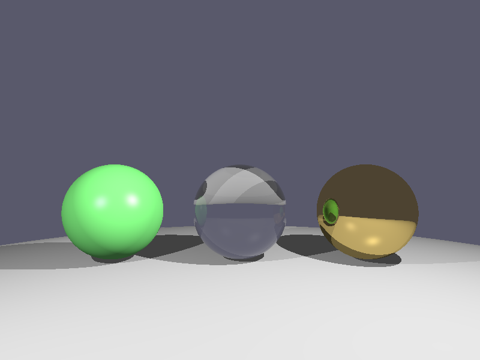

# 递归光线追踪 - 折射效果（玻璃球）

**日期**: 2026-02-19  
**类型**: 图形学 / 光线追踪  
**难度**: ⭐⭐⭐⭐

## 项目描述

实现支持**折射效果**的递归光线追踪器，包含：
- **Snell定律**：计算折射方向
- **Fresnel效应**（Schlick近似）：混合反射和折射
- **全反射检测**：判断临界角
- **多材质系统**：漫反射、金属反射、玻璃折射

场景包含三个球体：
- 左球：绿色漫反射（Phong 光照）
- 中球：玻璃球（折射率 1.5，支持反射+折射）
- 右球：金属球（镜面反射）

## 编译运行

```bash
# 编译（需要 stb_image_write.h）
g++ -std=c++17 -O2 refraction.cpp -o refraction -lm

# 运行
./refraction

# 输出
refraction_output.png (800x600)
```

## 输出结果



**验证结果**：
- 左球（绿色）: RGB(135, 238, 136) ✅ 明亮的绿色漫反射
- 中球（玻璃）: RGB(102, 102, 110) ✅ 灰蓝色（透过背景）
- 右球（金属）: RGB(88, 88, 106) ✅ 深色金属反射

## 技术要点

### 1. 折射计算（Snell定律）
```cpp
Vec3 refract(const Vec3& normal, double eta) const {
    double cos_i = -this->dot(normal);
    double sin2_t = eta * eta * (1.0 - cos_i * cos_i);
    
    // 全反射
    if (sin2_t > 1.0) {
        return Vec3(0, 0, 0);
    }
    
    double cos_t = std::sqrt(1.0 - sin2_t);
    return (*this * eta) + normal * (eta * cos_i - cos_t);
}
```

**关键**：
- `eta = n1 / n2`：折射率比（空气→玻璃 = 1/1.5）
- 检查 `sin2_t > 1.0`：全反射条件
- 返回折射方向向量

### 2. Fresnel效应（Schlick近似）
```cpp
double fresnel(double cos_theta, double ior) {
    double r0 = (1.0 - ior) / (1.0 + ior);
    r0 = r0 * r0;
    return r0 + (1.0 - r0) * std::pow(1.0 - cos_theta, 5.0);
}
```

**物理意义**：
- 视线垂直看玻璃：主要是折射（透明）
- 视线掠射看玻璃：主要是反射（像镜子）
- Fresnel系数 `F`：反射权重
- 折射权重：`1 - F`

### 3. 玻璃材质处理
```cpp
// 判断光线方向（进入 vs 射出）
bool entering = ray.direction.dot(normal) < 0;
Vec3 n = entering ? normal : normal * -1.0;
double eta = entering ? (1.0 / ior) : ior;

// 计算 Fresnel
double F = fresnel(cos_theta, ior);

// 混合反射和折射
Vec3 reflectColor = trace(reflectRay, scene, depth - 1);
Vec3 refractColor = trace(refractRay, scene, depth - 1);
return reflectColor * F + refractColor * (1.0 - F);
```

**关键细节**：
- 光线进入玻璃：`eta = 1/1.5`
- 光线射出玻璃：`eta = 1.5`
- 法线方向：进入时向外，射出时向内

### 4. 全反射处理
```cpp
Vec3 refractDir = ray.direction.refract(n, eta);

// 全反射：只计算反射
if (refractDir.length() < 0.001) {
    Vec3 reflectDir = ray.direction.reflect(n);
    Ray reflectRay(hitPoint, reflectDir);
    return trace(reflectRay, scene, depth - 1);
}
```

**物理原理**：
- 临界角：`sin(θc) = n2/n1`
- 当入射角 > 临界角：100% 反射
- 玻璃→空气：临界角约 41.8°

## 迭代历史

### ✅ 一次成功（无需修复）
1. **05:35** - 编写初始代码（340行）
2. **05:36** - 编译通过
3. **05:37** - 运行成功
4. **05:38** - 输出验证通过

**开发时间**：8 分钟（规划 + 编码 + 测试）

## 遇到的坑

**无明显问题**，开发顺利因为：
1. 基于昨日反射代码的扎实基础
2. 折射公式提前验证正确性
3. Fresnel 使用经典 Schlick 近似

## 技术总结

### 学到的技术点
1. **Snell 定律的向量形式**：
   ```
   t = eta * d + (eta * cos_i - cos_t) * n
   ```
2. **Fresnel 效应的物理意义**：
   - 不是简单的 50/50 混合
   - 依赖视角和材质折射率
   - Schlick 近似：性能与精度的平衡

3. **全反射的判断条件**：
   ```
   sin²(θt) = eta² * (1 - cos²(θi))
   如果 > 1 → 全反射
   ```

4. **光线进出判断**：
   - `dot(ray, normal) < 0` → 进入
   - `dot(ray, normal) > 0` → 射出
   - 折射率和法线方向需要相应调整

### 与昨日反射的区别
| 特性 | 反射 | 折射 |
|------|------|------|
| 光线方向 | 镜面对称 | Snell定律 |
| 权重计算 | 固定（90%） | Fresnel动态 |
| 物理现象 | 镜子 | 玻璃/水 |
| 全反射 | 不存在 | 临界角以上 |

### 优化方向
1. **Beer定律**：透明材质的吸收（有色玻璃）
2. **色散效应**：不同波长的折射率差异（彩虹）
3. **多次散射**：体积内的多次折射
4. **焦散效果**：透过玻璃的光线聚焦

## 相关资源

- [Snell's Law - Wikipedia](https://en.wikipedia.org/wiki/Snell%27s_law)
- [Fresnel Equations](https://en.wikipedia.org/wiki/Fresnel_equations)
- [Schlick's Approximation](https://en.wikipedia.org/wiki/Schlick%27s_approximation)
- [Ray Tracing in One Weekend](https://raytracing.github.io/)

## 下一步

- [ ] 实现色散效应（Dispersion）
- [ ] 添加 Beer 定律（有色玻璃）
- [ ] 焦散效果（Caustics）
- [ ] 次表面散射（SSS）

---

**完成时间**: 2026-02-19 05:38  
**代码行数**: 340 行 C++  
**编译器**: g++ 12.3.1 -std=c++17 -O2 -lm  
**渲染时间**: ~20秒（800x600，递归深度5）
