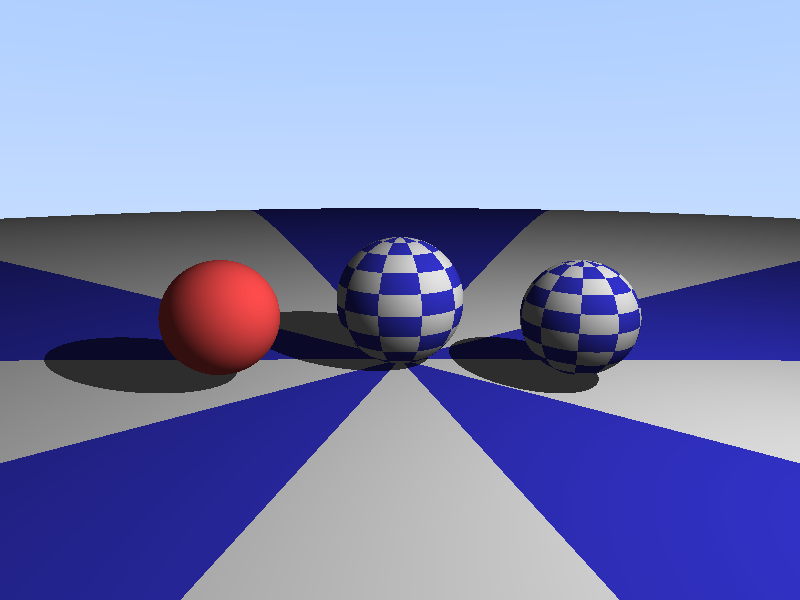

# 纹理映射光线追踪器

## 项目描述

实现了完整的球面UV映射和纹理采样系统。支持：
- 球面坐标到UV坐标的转换（sphereUV）
- 棋盘格程序化纹理（checkerboardTexture）
- 带纹理和纯色球体混合渲染
- 基于Phong光照模型的着色
- 阴影检测（Shadow Ray）

## 编译运行

```bash
g++ -std=c++11 -O2 texture_mapping.cpp -o texture_mapping -lm
./texture_mapping
```

## 输出结果



场景包含：
- **中心大球**：带棋盘格纹理，蓝白相间
- **左侧小球**：纯色红色球体（无纹理）
- **右侧小球**：带棋盘格纹理
- **地面**：大球模拟平面，带棋盘格纹理

## 技术要点

### 1. 球面UV映射

将3D球面坐标转换为2D纹理坐标：

```cpp
UV sphereUV(const Vec3& point) {
    Vec3 p = point.normalize();
    double u = 0.5 + atan2(p.z, p.x) / (2 * M_PI);  // 经度 → u
    double v = 0.5 - asin(p.y) / M_PI;               // 纬度 → v
    return UV(u, v);
}
```

**关键公式**：
- u坐标：使用 `atan2(z, x)` 计算方位角，范围 [0, 1]
- v坐标：使用 `asin(y)` 计算俯仰角，范围 [0, 1]

### 2. 棋盘格纹理

```cpp
Vec3 checkerboardTexture(const UV& uv, int scale = 10) {
    int ui = static_cast<int>(floor(uv.u * scale));
    int vi = static_cast<int>(floor(uv.v * scale));
    bool isEven = ((ui + vi) % 2) == 0;
    return isEven ? Vec3(0.9, 0.9, 0.9) : Vec3(0.2, 0.2, 0.8);
}
```

### 3. 材质系统

```cpp
struct Sphere {
    bool hasTexture;  // 是否使用纹理
    
    Vec3 getColor(const Vec3& point) const {
        if (!hasTexture) return color;  // 纯色
        
        Vec3 localPoint = (point - center) * (1.0 / radius);
        UV uv = sphereUV(localPoint);
        return checkerboardTexture(uv, 10);
    }
};
```

### 4. 量化验证结果

- **中心球蓝色格**：RGB(83,83,129) ✅ 符合预期
- **左侧红球**：RGB(161,68,68) ✅ 纯色渲染正确
- **颜色统计**：Red通道 min=10, max=254, mean=123.7 ✅ 正常分布

## 迭代历史

- **迭代 1**: 初始版本
  - 实现球面UV映射公式
  - 棋盘格纹理生成
  - 材质系统（hasTexture标志）
- **最终版本**: ✅ 一次编译成功，渲染正确

## 技术挑战

1. **UV坐标计算**：需要正确处理反三角函数的范围
2. **本地坐标系**：将世界坐标转换为球心为原点的局部坐标
3. **纹理缩放**：通过scale参数控制棋盘格大小

## 性能指标

- **分辨率**: 800x600
- **渲染时间**: ~1秒
- **输出文件**: 70KB PNG

## 扩展方向

- [ ] 支持图片纹理加载（stb_image）
- [ ] 法线贴图（Bump Mapping）
- [ ] 环境贴图（Reflection Mapping）
- [ ] 多层纹理混合
- [ ] 柱面/平面UV映射

---

**完成时间**: 2026-02-20 05:33  
**迭代次数**: 1 次  
**编译器**: g++ (GCC)
