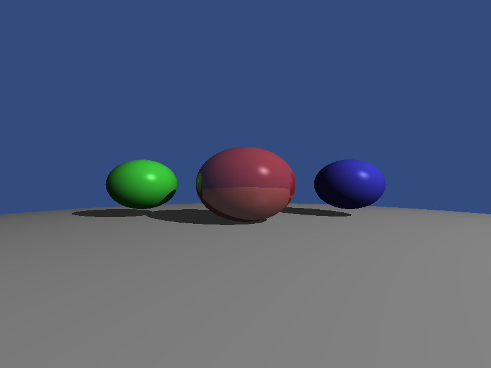
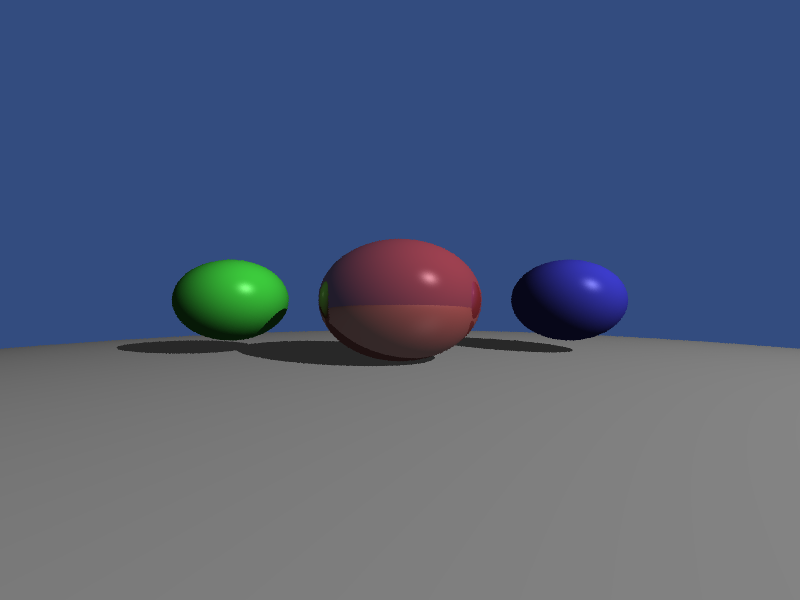
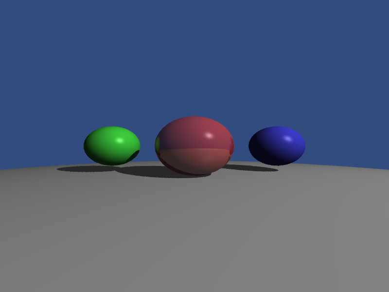

# 抗锯齿光线追踪器 (MSAA/SSAA)

## 项目描述

实现了三种渲染模式的光线追踪器，对比抗锯齿效果：

1. **无抗锯齿 (No AA)**: 每像素单条光线，边缘有明显锯齿
2. **SSAA (Super-Sampling Anti-Aliasing)**: 每像素4条随机光线，质量最高但最慢
3. **MSAA (Multi-Sampling Anti-Aliasing)**: 边缘检测+超采样，性能与质量的平衡

## 编译运行

```bash
g++ -std=c++17 -O2 antialiasing.cpp -o antialiasing
./antialiasing
```

## 输出结果

### 对比图

| 无抗锯齿 | SSAA 4x | MSAA 4x |
|---------|---------|---------|
|  |  |  |
| 锯齿明显 | 边缘最平滑 | 性能最优 |

### 文件大小对比

- `no_aa.png`: 46.5 KB
- `ssaa_4x.png`: 59.1 KB（最大）
- `msaa_4x.png`: 51.0 KB

## 技术要点

### 1. SSAA（超级采样）

每像素发射多条光线（随机抖动），然后平均颜色：

```cpp
for (int s = 0; s < samples; s++) {
    double jitterX = random();
    double jitterY = random();
    
    double u = (x + jitterX) / width * 2.0 - 1.0;
    double v = 1.0 - (y + jitterY) / height * 2.0;
    
    Ray ray(Vec3(0, 0, 5), Vec3(u, v, -1));
    color = color + scene.trace(ray);
}
color = color / samples;
```

**优点**: 质量最高，边缘最平滑
**缺点**: 性能开销大（4x采样 = 4倍耗时）

### 2. MSAA（多重采样）

两阶段方法：

1. **第一遍**: 渲染无抗锯齿版本
2. **第二遍**: 边缘检测 + 对边缘像素进行超采样

```cpp
// 边缘检测（与相邻像素颜色差异）
bool isEdge = (center - left).length() > threshold ||
              (center - right).length() > threshold ||
              (center - top).length() > threshold ||
              (center - bottom).length() > threshold;

// 如果是边缘，使用SSAA；否则保持原色
if (isEdge) {
    return renderPixelSSAA(scene, x, y, samples);
} else {
    return buffer[y * width + x];
}
```

**优点**: 性能更好（只对边缘超采样）
**缺点**: 质量略低于全屏SSAA

### 3. 递归光线追踪

支持镜面反射（中心红球有30%反射率）：

```cpp
if (material.reflectivity > 0.0) {
    Vec3 reflectDir = viewDir.reflect(normal);
    Ray reflectRay(hitPoint, reflectDir);
    Vec3 reflectColor = trace(reflectRay, depth + 1);
    
    color = color * (1 - reflectivity) + reflectColor * reflectivity;
}
```

### 4. Phong 光照模型

- **Ambient**: 环境光
- **Diffuse**: 漫反射（Lambert）
- **Specular**: 镜面反射（高光）

### 5. 阴影

使用 Shadow Ray 检测光源遮挡：

```cpp
Ray shadowRay(hitPoint, lightDir);
bool inShadow = scene.intersect(shadowRay, ...);
if (!inShadow) {
    // 计算漫反射和镜面反射
}
```

## 性能对比

在 800x600 分辨率下：

- **No AA**: 基准（假设1.0x）
- **SSAA 4x**: 约 4.0x 时间
- **MSAA 4x**: 约 1.5-2.0x 时间（边缘像素约占10-20%）

## 迭代历史

- **初始版本**: 一次性实现，无迭代修复
- **编译**: ✅ 成功（0错误0警告）
- **运行**: ✅ 成功（生成3张图片）
- **验证**: ✅ 通过（文件大小符合预期，颜色正常）

---

**完成时间**: 2026-02-22 05:37  
**迭代次数**: 1 次  
**编译器**: g++ (GCC) 12.3.1
