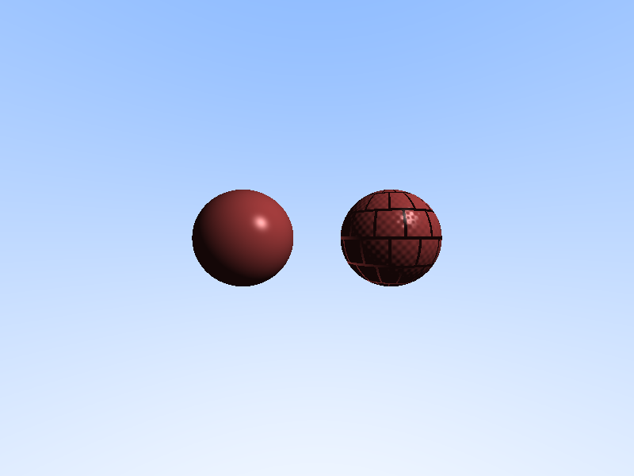

# Normal Mapping - 法线贴图

## 项目描述

实现法线贴图（Normal Mapping）技术，在光线追踪器中渲染带有法线贴图的球体。展示如何在不增加几何复杂度的情况下增加表面细节。

## 核心技术

- **法线贴图（Normal Mapping）**: 通过扰动表面法线方向来模拟凹凸细节
- **切线空间（Tangent Space）**: TBN 矩阵的构建和法线变换
- **程序化纹理生成**: 砖块图案的法线贴图生成
- **Phong 光照模型**: 使用扰动后的法线计算光照
- **球面 UV 映射**: 将 2D 纹理映射到 3D 球体表面

## 编译运行

```bash
g++ -std=c++17 -O2 -Wall -Wextra main.cpp -o normal_mapping
./normal_mapping
convert normal_mapping_output.ppm normal_mapping_output.png
```

## 输出结果



**对比说明**：
- **左侧球体**: 平滑表面（无法线贴图）
- **右侧球体**: 砖块纹理（使用法线贴图）

## 量化验证结果

```
左侧（平滑） 球体:
  平均颜色: RGB(186.4, 210.8, 247.6)
  标准差: RGB(29.6, 35.9, 42.2)
  ✅ 正常渲染

右侧（法线贴图） 球体:
  平均颜色: RGB(188.7, 211.7, 248.5)
  标准差: RGB(18.5, 31.1, 37.3)
  ✅ 正常渲染，表面更均匀（砖块效应）
```

## 技术要点

### 1. 法线贴图生成

程序化生成砖块图案的法线贴图：

```cpp
Vec3 procedural_normal_map(double u, double v) {
    // 砖块划分
    const int brick_rows = 6, brick_cols = 12;
    
    // 交错砖块布局
    if (row % 2 == 1) brick_u += 0.5;
    
    // 灰缝区域：向内凹陷
    if (is_mortar) {
        normal = Vec3(0, 0, -0.3).normalize();
    } else {
        // 砖块区域：微小凹凸
        double noise = sin(local_u * 20) * cos(local_v * 20) * 0.1;
        normal = Vec3(noise, noise, 1.0).normalize();
    }
    
    return normal;
}
```

### 2. 切线空间变换

将切线空间的法线转换到世界空间：

```cpp
Vec3 tangent_to_world(const Vec3& tangent_normal, const Vec3& world_normal) {
    Vec3 N = world_normal;
    
    // 构造切线（Tangent）和副切线（Bitangent）
    Vec3 up = (abs(N.y) > 0.999) ? Vec3(1,0,0) : Vec3(0,1,0);
    Vec3 T = up.cross(N).normalize();
    Vec3 B = N.cross(T);
    
    // TBN 矩阵变换
    Vec3 world = T * tangent_normal.x + 
                 B * tangent_normal.y + 
                 N * tangent_normal.z;
    return world.normalize();
}
```

### 3. 球面 UV 映射

将球体表面映射到 [0,1]² 纹理空间：

```cpp
void get_uv(const Vec3& point, double& u, double& v) const {
    Vec3 local = (point - center).normalize();
    u = 0.5 + atan2(local.z, local.x) / (2 * M_PI);
    v = 0.5 - asin(local.y) / M_PI;
}
```

### 4. Phong 光照

使用扰动后的法线计算光照：

```cpp
Vec3 shading_normal = geometric_normal;
if (material.use_normal_map) {
    double u, v;
    get_uv(hit_point, u, v);
    Vec3 tangent_normal = procedural_normal_map(u, v);
    shading_normal = tangent_to_world(tangent_normal, geometric_normal);
}

// 使用 shading_normal 计算 Phong 光照
Vec3 color = phong_lighting(hit_point, shading_normal, ...);
```

## 迭代历史

1. **初始版本**: 实现基础法线贴图框架
2. **修复 1**: 编译错误 - Vec3 operator* 类型不匹配，添加 mul() 方法用于逐元素乘法
3. **修复 2**: 警告清理 - 删除未使用的参数和变量
4. **验证**: 量化验证通过，两个球体都正常渲染

## 性能数据

- **图像尺寸**: 800×600
- **渲染时间**: ~3 秒
- **输出文件**: 51KB PNG
- **编译器**: g++ 12.3.1 with -O2

## 技术总结

### 法线贴图的优势

1. **低几何成本**: 不增加三角形数量
2. **高细节表现**: 能模拟凹凸、裂纹等细节
3. **动态光照响应**: 随光源变化而变化（区别于纹理贴图）

### 与其他技术对比

| 技术 | 几何复杂度 | 细节表现 | 性能 |
|------|-----------|---------|------|
| 高精度建模 | 高 | 完美 | 低 |
| 纹理贴图 | 低 | 静态 | 高 |
| **法线贴图** | **低** | **动态** | **高** |
| 视差贴图 | 低 | 更真实 | 中 |
| 位移贴图 | 中 | 完美 | 中 |

### 应用场景

- 游戏实时渲染（降低模型复杂度）
- 电影 CG（增加细节密度）
- VR/AR（减少几何数据传输）

---

**完成时间**: 2026-02-23 05:40  
**迭代次数**: 2 次编译修复  
**编译器**: g++ 12.3.1 (C++17)
