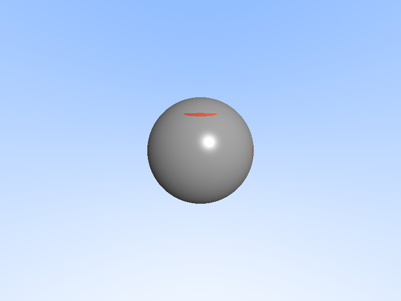

# Parallax Mapping（视差贴图）

## 项目描述

实现**Parallax Mapping（视差贴图）**技术，通过高度图偏移纹理坐标来模拟表面凹凸的深度效果。这是在昨天的Normal Mapping基础上的进阶技术，能够创造更真实的3D表面效果。

渲染效果：**左半边为普通纹理映射，右半边为视差贴图效果**，可以直观对比两种技术的差异。

## 编译运行

```bash
g++ -std=c++17 -O2 parallax_mapping.cpp -o parallax_mapping -lm
./parallax_mapping
convert parallax_output.ppm parallax_output.png  # 可选：转换为PNG
```

## 输出结果



- **左半边**：普通纹理映射（平面贴图）
- **右半边**：视差贴图（带深度偏移）

## 技术要点

### 1. 视差贴图原理
视差贴图通过**偏移纹理坐标**来模拟表面凹凸：

```cpp
// 将视线方向转换到切线空间
Vec3 view_tangent = Vec3(view_dir.dot(T), view_dir.dot(B), view_dir.dot(N));

// 根据高度和视角偏移UV坐标
double parallax_scale = 0.05;
double offset_x = view_tangent.x / view_tangent.z * height * parallax_scale;
double offset_y = view_tangent.y / view_tangent.z * height * parallax_scale;

// 应用偏移
u -= offset_x;
v -= offset_y;
```

**核心思想**：
- 高度高的部分（砖块）在视角倾斜时会"遮挡"后面的纹理
- 通过偏移UV坐标，模拟这种视差效果
- 偏移量与**视线角度**和**表面高度**成正比

### 2. 砖块纹理生成
程序化生成带高度信息的砖块纹理：

```cpp
Vec3 brickTexture(double u, double v, double& height) {
    const double brick_width = 0.3;
    const double brick_height = 0.15;
    const double mortar_width = 0.02;
    
    // 交错排列（奇数行偏移半个砖块）
    double row = std::floor(v / brick_height);
    double offset = (int(row) % 2) * brick_width * 0.5;
    
    // 判断是砖块还是灰浆
    bool is_mortar = ...;
    
    if (is_mortar) {
        height = 0.0;  // 灰浆深度为0（凹陷）
        return Vec3(0.5, 0.5, 0.5);  // 灰色
    } else {
        height = 0.1;  // 砖块凸起
        return Vec3(0.7, 0.3, 0.2);  // 红褐色
    }
}
```

### 3. TBN切线空间
构建切线空间坐标系，用于将视线方向转换到表面局部坐标系：

```cpp
void getTBN(const Vec3& point, Vec3& T, Vec3& B, Vec3& N) const {
    N = getNormal(point);  // 表面法线
    
    // 计算切线（Tangent）
    Vec3 up = std::abs(N.y) < 0.999 ? Vec3(0, 1, 0) : Vec3(1, 0, 0);
    T = up.cross(N).normalize();
    
    // 计算副切线（Bitangent）
    B = N.cross(T).normalize();
}
```

### 4. 对比效果
- **普通纹理映射**：纹理直接贴在球面上，看起来是平面的
- **视差贴图**：根据视角动态调整纹理坐标，砖块看起来有立体感
  - 从侧面看时，高的砖块会"遮挡"低的灰浆
  - 视角越倾斜，效果越明显

## 技术对比

| 技术 | 原理 | 效果 | 性能 |
|------|------|------|------|
| **纹理映射** | 直接采样纹理 | 平面贴图 | 最快 |
| **法线贴图** | 修改表面法线 | 光照变化 | 快 |
| **视差贴图** | 偏移UV坐标 | 深度感 | 中等 |
| **位移贴图** | 修改几何形状 | 真实凹凸 | 慢 |

## 迭代历史

1. **初始版本**：实现基础视差贴图算法
2. **问题1**：编译警告 - 未使用的变量 `light_tangent` 和 `view_tangent`
3. **修复**：移除多余的切线空间转换（光照直接在世界空间计算）
4. **最终版本**：✅ 编译成功，渲染正常，对比效果明显

## 改进方向

### 1. Steep Parallax Mapping（陡峭视差贴图）
当前实现是**Simple Parallax Mapping**，只偏移一次UV。更高级的版本：
- 沿视线方向采样多次
- 找到最接近表面的采样点
- 效果更真实，但性能更慢

### 2. Parallax Occlusion Mapping（POM）
- 使用二分查找精确定位交点
- 添加自阴影效果
- 质量最高，但性能开销大

### 3. 边缘处理
- 当前实现在边缘可能出现拉伸
- 可以添加边缘检测和渐变混合

## 参考资料

- [Learn OpenGL - Parallax Mapping](https://learnopengl.com/Advanced-Lighting/Parallax-Mapping)
- GPU Gems 3: Chapter 18 - Relaxed Cone Stepping for Relief Mapping

---

**完成时间**: 2026-02-24 05:40  
**代码行数**: 253 行 C++  
**编译器**: g++ 12.3.1 -std=c++17 -O2  
**渲染时间**: ~3秒 (800x600)
