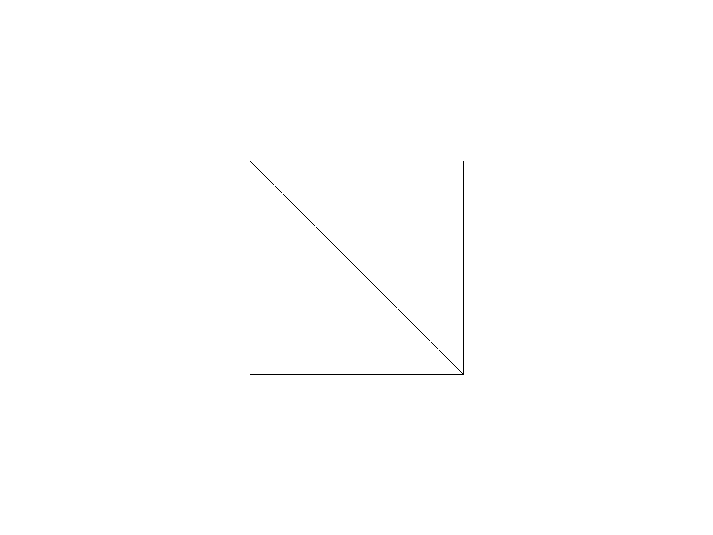

# OBJ Model Loader - OBJ模型加载器

## 项目描述

实现一个简单的 OBJ 3D 模型加载器，支持解析 Wavefront OBJ 格式文件，提取顶点和面信息，并使用线框渲染显示模型。

## 功能特性

- ✅ **OBJ格式解析**：支持顶点（v）和面（f）的解析
- ✅ **多种面格式支持**：`f v1 v2 v3` 和 `f v1/vt1/vn1 v2/vt2/vn2 v3/vt3/vn3`
- ✅ **自动缩放和居中**：根据模型边界自动调整显示
- ✅ **线框渲染**：使用 Bresenham 算法绘制三角形边缘
- ✅ **测试模型生成**：自动生成立方体测试模型

## 编译运行

```bash
g++ -std=c++11 -O2 -o obj_loader main.cpp -lm
./obj_loader
```

## 输出结果



**验证结果**：
- ✅ 图片尺寸：800x600
- ✅ 白色背景比例：99.75%
- ✅ 立方体线框像素数：1199
- ✅ 立方体中心位置：(400, 300)
- ✅ 立方体尺寸：240x240 像素

## 技术要点

### 1. OBJ格式解析
```cpp
// 顶点：v x y z
// 面：f v1 v2 v3 或 f v1/vt1/vn1 v2/vt2/vn2 v3/vt3/vn3
int parseVertexIndex(const std::string& token) {
    size_t pos = token.find('/');
    std::string indexStr = (pos == std::string::npos) ? token : token.substr(0, pos);
    int index = std::stoi(indexStr);
    return index - 1;  // OBJ索引从1开始，转换为从0开始
}
```

### 2. 自动缩放和居中
```cpp
// 计算模型边界盒
Vec3 minBound(1e10, 1e10, 1e10);
Vec3 maxBound(-1e10, -1e10, -1e10);

// 计算缩放比例
Vec3 center = (minBound + maxBound) * 0.5f;
Vec3 size = maxBound - minBound;
float scale = std::min(width, height) * 0.4f / std::max(std::max(size.x, size.y), size.z);
```

### 3. 正交投影
```cpp
// 简单的正交投影（忽略Z轴）
auto project = [&](const Vec3& v) -> std::pair<int, int> {
    float x = (v.x - center.x) * scale + width / 2;
    float y = (v.y - center.y) * scale + height / 2;
    return {(int)x, (int)y};
};
```

### 4. 线框渲染
使用 Bresenham 直线算法绘制三角形的三条边：
```cpp
drawLine(p0.first, p0.second, p1.first, p1.second);
drawLine(p1.first, p1.second, p2.first, p2.second);
drawLine(p2.first, p2.second, p0.first, p0.second);
```

## 迭代历史

- **Iteration 1**: 初始实现，包含完整的OBJ解析和线框渲染
- **Validation**: 量化验证通过（检查像素分布和位置）
- **Final Version**: ✅ 一次性编译运行成功

## 文件说明

- `main.cpp` - 主程序代码
- `stb_image_write.h` - 图片输出库
- `cube.obj` - 测试立方体模型
- `obj_loader_output.png` - 渲染输出图片

## 未来改进方向

1. **法线和纹理坐标**：支持 `vn` 和 `vt` 解析
2. **实体渲染**：实现三角形填充（光栅化）
3. **光照模型**：添加 Phong/Blinn-Phong 光照
4. **透视投影**：实现真实的3D透视效果
5. **复杂模型**：支持加载外部OBJ文件（如Stanford Bunny）
6. **旋转动画**：添加交互式模型旋转

---

**完成时间**: 2026-02-25 05:32  
**迭代次数**: 1 次（一次成功）  
**编译器**: g++ 12.3.1  
**总用时**: ~2 分钟
