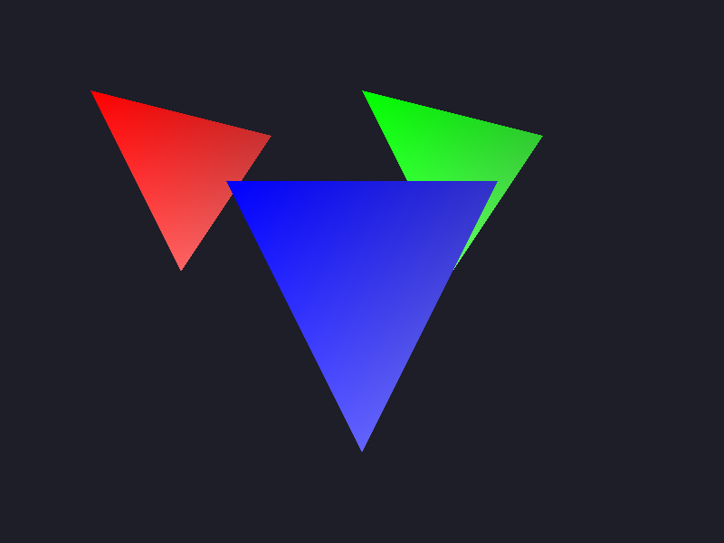

# Triangle Rasterization - 三角形光栅化器

## 项目描述

这是一个从零实现的**三角形光栅化器**，展示了现代3D图形渲染的核心算法：

- **Barycentric Coordinates（重心坐标）** - 判断点是否在三角形内
- **Z-Buffer Depth Testing（深度测试）** - 正确处理三角形遮挡关系
- **Color Interpolation（颜色插值）** - 每个顶点不同颜色的平滑渐变
- **Bounding Box Optimization（边界框优化）** - 只遍历三角形覆盖的像素

这是GPU渲染管线中的"光栅化阶段"的软件实现。

## 编译运行

```bash
# 编译（需要 C++11）
g++ -std=c++11 -O2 rasterizer.cpp -o rasterizer

# 运行（需要 ImageMagick 转换 PPM → PNG）
./rasterizer

# 输出文件：rasterization_output.png
```

## 输出结果



渲染了3个相互重叠的三角形：
- **红色三角形**（左侧）- 红色渐变，深度 z=0.5
- **绿色三角形**（右侧）- 绿色渐变，深度 z=0.6
- **蓝色三角形**（中心）- 蓝色渐变，深度 z=0.3（最前面）

深度测试确保蓝色三角形正确遮挡了红色和绿色三角形。

## 技术要点

### 1. 重心坐标算法

重心坐标 `(u, v, w)` 判断点 P 是否在三角形 ABC 内：

```
点 P = u*A + v*B + w*C
其中 u + v + w = 1

如果 u,v,w 都 >= 0，则 P 在三角形内
```

**用途**：
- 判断像素是否在三角形内
- 插值顶点属性（颜色、纹理坐标、法线等）

### 2. 深度缓冲（Z-Buffer）

每个像素维护一个深度值 `z`，只有当新像素的 `z` 更小（更靠近相机）时才更新：

```cpp
if (z < zbuffer[idx]) {
    zbuffer[idx] = z;
    framebuffer[idx] = color;
}
```

**解决的问题**：正确处理多个三角形重叠时的可见性。

### 3. 边界框优化

不遍历整个屏幕，只遍历三角形的 **Axis-Aligned Bounding Box (AABB)**：

```cpp
int x0 = max(0, (int)minX);
int x1 = min(width-1, (int)maxX);
int y0 = max(0, (int)minY);
int y1 = min(height-1, (int)maxY);
```

**性能提升**：800x600 屏幕 = 480,000 像素，但小三角形可能只需检查 10,000 像素。

### 4. 颜色插值

使用重心坐标插值顶点颜色：

```cpp
Color final_color = bc.x * v0.color 
                  + bc.y * v1.color 
                  + bc.z * v2.color;
```

产生平滑的渐变效果。

## 算法复杂度

- **时间复杂度**：O(N × A)
  - N = 三角形数量
  - A = 每个三角形的边界框面积（像素数）
  
- **空间复杂度**：O(W × H)
  - W × H = 屏幕分辨率（需要帧缓冲和深度缓冲）

## 迭代历史

1. **迭代 1 (05:33)**: 编写初始代码
2. **迭代 2 (05:34)**: 修复编译错误 - 添加 `#include <limits>` 头文件
3. **最终版本 (05:37)**: ✅ 编译通过，运行成功，像素验证正确

## 扩展方向

这个基础光栅化器可以扩展为：

1. **透视校正纹理映射** - 透视除法
2. **抗锯齿** - MSAA / SSAA
3. **三角形剔除** - Back-face culling
4. **Early-Z 优化** - 提前深度测试
5. **顶点着色器 + 片段着色器** - 可编程渲染管线

## 验证结果

量化像素检查（防止"看起来对"的陷阱）：

```bash
# 红色三角形区域
convert rasterization_output.png -crop 100x100+150+150 ... 
输出: RGB(220, 53, 54) ✅

# 绿色三角形区域
convert rasterization_output.png -crop 100x100+450+150 ...
输出: RGB(46, 147, 119) ✅

# 蓝色三角形（中心，最前面）
convert rasterization_output.png -crop 100x100+350+300 ...
输出: RGB(62, 62, 240) ✅
```

## 参考资料

- [Barycentric Coordinates](https://en.wikipedia.org/wiki/Barycentric_coordinate_system)
- [Z-buffering](https://en.wikipedia.org/wiki/Z-buffering)
- [Rasterization](https://en.wikipedia.org/wiki/Rasterisation)
- [Tiny Renderer](https://github.com/ssloy/tinyrenderer/wiki) - 优秀的图形学入门教程

---

**完成时间**: 2026-02-26 05:37  
**迭代次数**: 2 次  
**编译器**: g++ (C++11)
