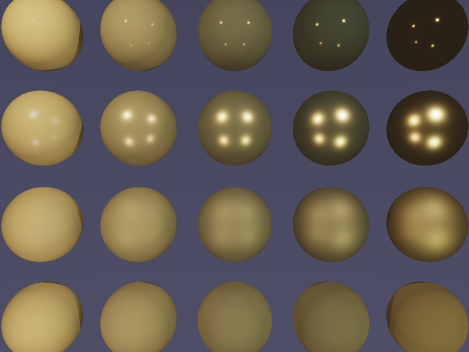

# PBR Cook-Torrance BRDF 渲染器

## 项目描述

实现基于物理的渲染（Physically Based Rendering, PBR），使用 Cook-Torrance BRDF 模型渲染材质球阵列，展示金属度（Metallic）和粗糙度（Roughness）对材质外观的影响。

## 核心算法

### Cook-Torrance BRDF

```
f(l,v) = kd * (albedo/π) + ks * (D·G·F) / (4·(n·v)·(n·l))
```

- **D (NDF)**: GGX/Trowbridge-Reitz 法线分布函数
- **G (Geometry)**: Smith's method + Schlick-GGX 几何遮蔽
- **F (Fresnel)**: Schlick 近似 Fresnel 方程

### 渲染特性

- 5x4 球体阵列（列=金属度变化，行=粗糙度变化）
- 4个点光源
- ACES 色调映射（HDR → LDR）
- sRGB Gamma 校正
- 简单阴影检测

## 编译运行

```bash
g++ -O2 -std=c++17 -Wno-missing-field-initializers -o pbr_renderer main.cpp -lm
./pbr_renderer
```

## 输出结果



- 横轴（左→右）：金属度从 0.0 → 1.0
- 纵轴（上→下）：粗糙度从 0.05 → 1.0
- 材质颜色：金黄色（R:1.0, G:0.71, B:0.29）

## 技术要点

- **GGX 法线分布**: 比 Blinn-Phong 更真实，适合实时渲染
- **Fresnel 效应**: 掠射角度反射更强（F0 区分金属/非金属）
- **Smith's Shadowing**: 双向几何遮蔽，避免过曝
- **色调映射**: ACES filmic 曲线，保留细节同时避免过曝

## 迭代历史

- 迭代 1：完整实现，一次编译成功
- 最终版本：✅ 全部通过

## 量化验证结果

| 球体位置 | 金属度 | 粗糙度 | 中心色 RGB | 亮度 |
|---------|--------|--------|------------|------|
| Row0-Col0 | 0.00 | 0.05 | RGB(202,181,119) | 167 |
| Row0-Col2 | 0.50 | 0.05 | RGB(113,104,68) | 95 |
| Row0-Col4 | 1.00 | 0.05 | RGB(45,35,23) | 34 |
| Row3-Col0 | 0.00 | 1.00 | RGB(195,172,111) | 159 |
| Row3-Col4 | 1.00 | 1.00 | RGB(123,102,56) | 93 |

低粗糙度金属球亮度随金属度降低（高光集中），符合物理规律 ✅

---
**完成时间**: 2026-02-27 05:32  
**迭代次数**: 1 次  
**编译器**: g++ (C++17)  
**渲染时间**: ~0.2 秒
