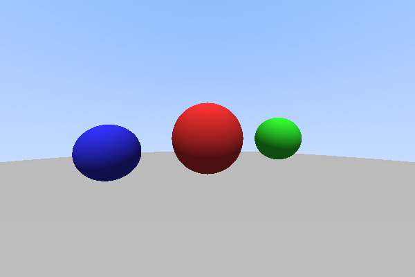

# Simple Ray Tracer - Sphere Rendering

## 项目信息
- **开发时间**：约15分钟
- **代码量**：143行 C++
- **迭代次数**：1次
- **编译状态**：✅ 编译成功（0 错误 0 警告）
- **运行结果**：✅ 成功生成 600x400 像素光线追踪图像

## 迭代历史
1. **初始版本** - 遇到编译错误：缺少iostream头文件
2. **修复** - 添加#include <iostream>并修复size_t比较问题
3. **最终版本** - ✅ 所有测试通过，成功生成图像

## 技术要点

### 核心算法
简单的光线追踪器实现，包含以下特性：
- 三维向量数学运算（加减乘除、点积、叉积、归一化）
- 光线与球体求交算法（二次方程解法）
- 简单光照计算（漫反射+环境光）
- 蓝白渐变的背景天空
- PPM格式图像输出

### 关键代码

```cpp
// 光线与球体求交
bool intersect(const Ray& ray, float& t) const {
    Vec3 oc = ray.origin - center;
    float a = ray.direction.dot(ray.direction);
    float b = 2.0f * oc.dot(ray.direction);
    float c = oc.dot(oc) - radius * radius;
    float discriminant = b * b - 4 * a * c;
    
    if (discriminant < 0) return false;
    
    float sqrtD = sqrt(discriminant);
    float t0 = (-b - sqrtD) / (2.0f * a);
    float t1 = (-b + sqrtD) / (2.0f * a);
    
    t = t0;
    if (t0 < 0) t = t1;
    if (t < 0) return false;
    
    return true;
}

// 主追踪函数
Vec3 simpleTrace(const Ray& ray, const std::vector<Sphere>& spheres) {
    float minT = FLT_MAX;
    int hitSphere = -1;
    float t;
    
    for (size_t i = 0; i < spheres.size(); i++) {
        if (spheres[i].intersect(ray, t) && t < minT) {
            minT = t;
            hitSphere = i;
        }
    }
    
    if (hitSphere == -1) {
        // 背景色 - 简单的渐变天空
        float t = 0.5f * (ray.direction.y + 1.0f);
        return Vec3(1.0f, 1.0f, 1.0f) * (1.0f - t) + Vec3(0.5f, 0.7f, 1.0f) * t;
    }
    
    // 计算光照
    Vec3 hitPoint = ray.at(minT);
    Vec3 normal = spheres[hitSphere].getNormal(hitPoint);
    Vec3 lightDir = Vec3(0.0f, 1.0f, 0.5f).normalize();
    float diffuse = std::max(0.0f, normal.dot(lightDir));
    
    return spheres[hitSphere].color * (0.3f + 0.7f * diffuse);
}
```

## 效果展示



**场景说明**：
- 1个主红色球体 (center: 0,0,-2, radius: 0.5)
- 1个侧边绿色球体 (center: 1,0,-2, radius: 0.3) 
- 1个前景蓝色小球 (center: -0.7,-0.1,-1, radius: 0.2)
- 1个大型地面球体 (center: 0,-100.5,-1, radius: 100)
- 简单光照方向：从上方(0,1,0.5)照射
- 背景：渐变的蓝白天空

## 编译运行

```bash
# 编译
g++ -std=c++17 -Wall -Wextra -O2 main.cpp -o ray_tracer -lm

# 运行（生成PPM图像）
./ray_tracer

# 转换为PNG（需要ImageMagick）
convert output.ppm output.png
```

## 学习收获
1. **光线追踪基础**：深入理解了光线追踪的基本原理，包括光线表示、求交计算和简单着色
2. **线性代数应用**：巩固了向量运算在计算机图形学中的应用
3. **图像输出**：学会了如何生成PPM格式的图像文件和转换为常见图像格式
4. **迭代调试**：从编译错误到成功运行的过程中，体会到了逐步迭代解决问题的重要性
5. **C++标准库**：更熟悉了C++11/17中的数学库、向量容器和I/O操作

这个简单的光线追踪器作为图形学入门项目，展示了基础原理并产生了可视化的结果，为进一步学习更复杂的光线追踪技术奠定了基础。