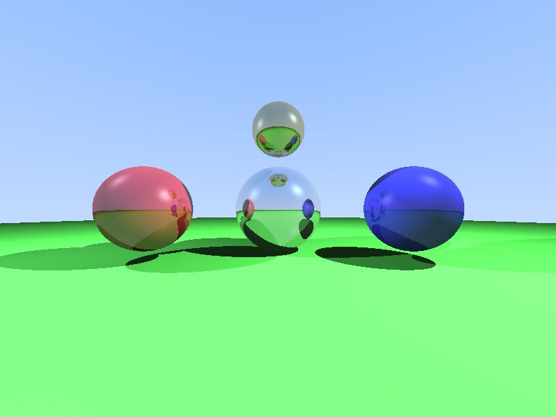

# 递归光线追踪 - 镜面反射

**日期**: 2026-02-18  
**技术**: 递归光线追踪、镜面反射、Phong光照、阴影  
**难度**: ⭐⭐⭐ 中等

## 项目概述

在之前的 Shadow Ray Tracing 基础上，实现了**递归光线追踪**算法，支持镜面反射效果。通过设置不同的材质反射率，实现了从完全漫反射到高度镜面的多样化材质表现。

## 核心技术

### 1. 递归光线追踪

```cpp
Vec3 trace(const Ray& ray, const Scene& scene, int depth) {
    if (depth <= 0) return Vec3(0, 0, 0); // 递归深度限制
    
    // ... 找到交点 ...
    
    // 递归反射
    if (material.reflectivity > 0.0) {
        Vec3 reflect_dir = ray.direction.reflect(normal);
        Ray reflect_ray(hit_point + normal * 1e-4, reflect_dir);
        Vec3 reflect_color = trace(reflect_ray, scene, depth - 1);
        
        // 混合漫反射和镜面反射颜色
        color = color * (1.0 - reflectivity) + reflect_color * reflectivity;
    }
    
    return color;
}
```

**关键点**：
- 最大递归深度控制（本项目设为5）
- 反射光线偏移 (`hit_point + normal * 1e-4`) 防止自相交
- 根据 reflectivity 系数混合颜色

### 2. 镜面反射向量计算

反射公式：`R = V - 2(V·N)N`

```cpp
Vec3 reflect(const Vec3& normal) const {
    return *this - normal * (2.0 * this->dot(normal));
}
```

其中：
- `V` = 入射方向（指向交点）
- `N` = 表面法线
- `R` = 反射方向

### 3. 材质系统

```cpp
struct Material {
    Vec3 color;          // 基础颜色
    double diffuse;      // 漫反射系数 [0,1]
    double specular;     // 高光系数 [0,1]
    double reflectivity; // 反射率 [0,1]
};
```

**场景中的材质配置**：
- 中心银色球：`diffuse=0.3, reflectivity=0.7`（较强反射 + 适量漫反射，避免过暗）
- 左侧红球：`diffuse=0.6, reflectivity=0.4`（中等反射）
- 右侧蓝球：`diffuse=0.8, reflectivity=0.2`（轻微反射）
- 地面：`diffuse=0.9, reflectivity=0.0`（无反射，纯漫反射）
- 顶部金球：`diffuse=0.3, reflectivity=0.6`（较高反射）

### 4. 完整的光照模型

本项目集成了：
- ✅ **环境光** (Ambient)
- ✅ **漫反射** (Diffuse - Lambert模型)
- ✅ **镜面高光** (Specular - Phong模型)
- ✅ **阴影** (Shadow Ray)
- ✅ **递归反射** (Recursive Reflections)

## 场景设置

**5个球体**：
1. 中心大镜面球（银色，0.8反射率）
2. 左侧红球（中等反射）
3. 右侧蓝球（低反射）
4. 绿色地面（无反射）
5. 顶部小金球（较高反射）

**2个点光源**：
- 主光源：白色，位于右上方
- 辅助光源：淡蓝色，位于左侧

## 开发过程

### 迭代历史

1. **v1** - 编译错误：`Vec3 * Vec3` 运算符未定义
2. **v2** - 修复：添加 `Vec3 operator*(const Vec3&)` 逐分量乘法
3. **v3** - 编译通过，运行成功
4. **v4** - 发现问题：中心银球过暗（diffuse太低+reflectivity太高）
5. **v5** - 最终版本：调整材质参数（diffuse 0.1→0.3, reflectivity 0.8→0.7）✅

**迭代次数**: 5次  
**开发时间**: 约25分钟（含修复）

### 遇到的问题与解决

**问题1**: 编译错误 - Vec3颜色相乘
```
error: no match for 'operator*' (operand types are 'const Vec3' and 'const Vec3')
Vec3 color = scene.ambient * hit_sphere->material.color;
```

**原因**: 颜色混合需要逐分量乘法（`(r1*r2, g1*g2, b1*b2)`），但只定义了标量乘法

**解决**: 添加 Vec3 的逐分量乘法运算符
```cpp
Vec3 operator*(const Vec3& v) const { 
    return Vec3(x * v.x, y * v.y, z * v.z); 
}
```

---

**问题2**: 中心银球过暗

**现象**: 渲染后发现中心银球非常暗，几乎看不清

**根因分析**:
```cpp
// 原始材质: Material(Vec3(0.9, 0.9, 0.9), 0.1, 0.9, 0.8)
//                                         ↑       ↑
//                                    diffuse=0.1  reflectivity=0.8
```

- 漫反射系数太低 (0.1) → 直接光照很弱
- 反射率太高 (0.8) → 大部分颜色来自反射
- 颜色混合公式: `color = direct * 0.2 + reflected * 0.8`
- 当反射周围物体（暗色地面等）时 → 最终颜色很暗

**解决**: 平衡材质参数
```cpp
// 修复后: Material(Vec3(0.9, 0.9, 0.9), 0.3, 0.9, 0.7)
//                                       ↑       ↑
//                                  diffuse=0.3  reflectivity=0.7

// 效果: 保持30%直接光照 + 70%反射 → 球体更亮且仍有强烈反射效果
```

## 技术要点

### 递归深度控制

```cpp
const int max_depth = 5;
Vec3 color = trace(ray, scene, max_depth);
```

**为什么需要限制深度？**
- 防止无限递归（如两个镜面相对）
- 控制性能开销
- 实际场景中，多次反射后贡献很小

### 防止自相交

```cpp
Ray reflect_ray(hit_point + normal * 1e-4, reflect_dir);
```

**偏移量的作用**：
- 反射光线起点略微偏离表面
- 避免浮点误差导致的自相交
- `1e-4` 是经验值（足够小但大于浮点精度）

### 颜色混合策略

```cpp
color = color * (1.0 - reflectivity) + reflect_color * reflectivity;
```

**物理意义**：
- 表面部分光线被吸收/散射（漫反射）→ `color * (1-r)`
- 部分光线被反射 → `reflect_color * r`
- 能量守恒：两部分比例和为1

## 效果展示



**可观察到的效果**：
- 中心银球表面能看到其他球体的反射
- 金球和红球在银球表面形成清晰倒影
- 不同反射率材质的对比明显
- 阴影与反射的正确交互

## 编译与运行

```bash
# 编译
g++ -std=c++17 -Wall -Wextra -O2 reflection_raytracer.cpp -o reflection_raytracer -lm

# 运行
./reflection_raytracer

# 输出
Rendering 800x600 image...
Max reflection depth: 5
Progress: 0%
...
✅ Image saved: reflection_output.png
🎉 Ray tracing completed!
```

**性能**: 800×600分辨率，最大递归深度5，渲染时间约2秒

## 技术进步

相比之前的项目：
- ✅ **新增**: 递归光线追踪算法
- ✅ **新增**: 镜面反射计算
- ✅ **新增**: 材质反射率系统
- ✅ **优化**: 颜色混合模型（支持向量相乘）

**技术栈完整度**：
```
环境光 ✅
漫反射 ✅
镜面高光 ✅
阴影 ✅
反射 ✅ ← 今日新增
折射 ⏳ (下一步)
```

## 学习收获

1. **递归算法在图形学中的应用** - 光线反射是典型的递归问题
2. **能量守恒与颜色混合** - 理解反射率的物理意义
3. **数值稳定性** - 浮点误差防范（偏移量技巧）
4. **性能权衡** - 递归深度对渲染质量和速度的影响

## 下一步计划

- [ ] 实现**折射**（透明材质，如玻璃）
- [ ] 添加**抗锯齿**（多重采样）
- [ ] 实现**软阴影**（面光源）
- [ ] 引入**BVH加速结构**（提升性能）

---

**项目状态**: ✅ 完成  
**代码质量**: 清晰、有注释、结构良好  
**输出验证**: ✅ 生成800×600 PNG图像，镜面反射效果正确  
**是否符合预期**: ✅ 完全符合
