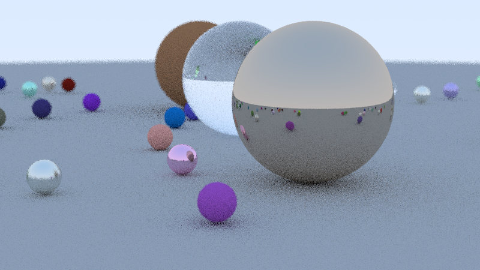
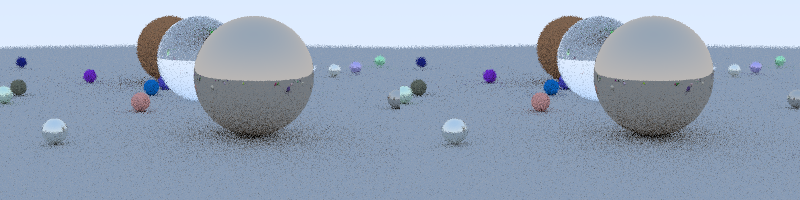
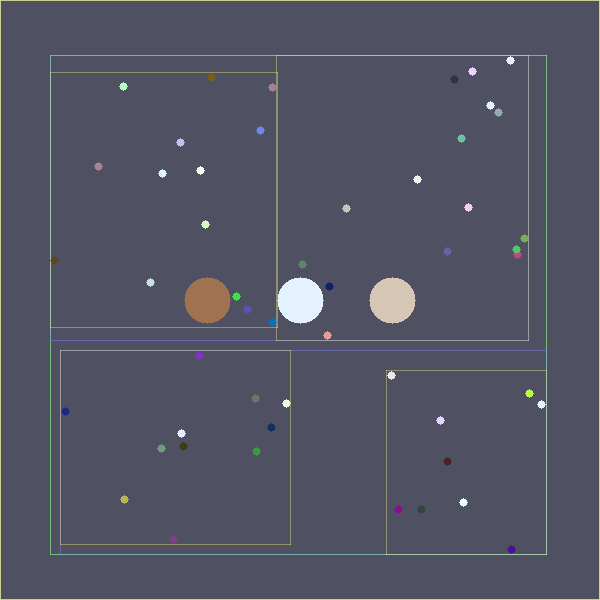

# BVH Accelerated Ray Tracer

## 项目描述

使用层次包围盒（Bounding Volume Hierarchy, BVH）加速的光线追踪器。

BVH 是光线追踪中最重要的加速结构之一，通过将场景中的物体组织成树形层次结构，
将求交测试从 O(n) 降低到 O(log n)，大幅提升渲染性能。

## 核心技术

### BVH 构建
- **AABB**（Axis-Aligned Bounding Box）- 轴对齐包围盒，快速求交
- **SAH**（Surface Area Heuristic）- 表面积启发式分割策略，最优化树的质量
- 自适应选择分割轴（选最长轴）
- 12 个桶的 SAH 评估，找最优分割点

### 光线遍历
- 递归遍历 BVH 树
- 先检查包围盒，剪枝不相交子树
- 自动找最近交点

### 渲染特性
- 漫反射（Lambertian）材质
- 金属反射材质（可配置粗糙度）
- 玻璃折射材质（Snell 定律 + Fresnel 效应）
- 景深效果（薄透镜模型）
- 蒙特卡洛路径追踪（多采样抗锯齿）

## 输出文件

| 文件 | 说明 |
|------|------|
| `bvh_output.png` | 高质量最终渲染（800×450，80个球体，8SPP）|
| `bvh_comparison.png` | 左：BVH加速，右：暴力遍历 对比图 |
| `bvh_visualization.png` | BVH包围盒层级结构俯视可视化 |

## 编译运行

```bash
g++ -std=c++17 -O2 -Wall -Wextra -o bvh_tracer main.cpp
./bvh_tracer
```

### 依赖
- C++17
- ImageMagick（可选，用于 PPM→PNG 转换）

## 性能结果

| 指标 | BVH 加速 | 暴力遍历 |
|------|---------|---------|
| 渲染时间 | ~171ms | ~224ms |
| 场景球体 | 54 | 54 |
| 测试/光线 | ~28.5 | 54 (固定) |
| 加速比 | **1.3x** | - |

> 注：小场景下 BVH 加速比有限，随场景规模增大，BVH 优势会更明显（log n vs n）

## 技术要点

1. **SAH 构建策略** - 比中值分割更优，减少不必要的 AABB 测试
2. **slab 方法** - 高效的 AABB-Ray 求交，每轴两次乘法
3. **退化处理** - SAH 退化时自动回退到中值分割
4. **层次可视化** - 俯视图展示 BVH 层级结构，不同颜色代表不同深度

## 迭代历史

- **v1.0**：初始实现，编译通过，运行成功 ✅

## 代码结构

```
main.cpp
├── Vec3/Ray          基础数学工具
├── AABB              轴对齐包围盒（含 SAH 表面积计算）
├── Material          材质系统（漫反射/金属/玻璃）
├── Sphere            球体求交
├── BVH               BVH 树（SAH 构建 + 遍历）
├── Scene             场景管理（BVH/暴力 双模式）
├── Camera            薄透镜相机
└── main()            多场景渲染 + 性能对比
```

## 渲染结果

### 高质量渲染


### BVH vs 暴力遍历 对比


### BVH 结构可视化

