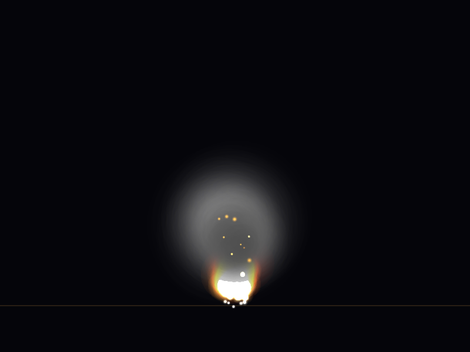
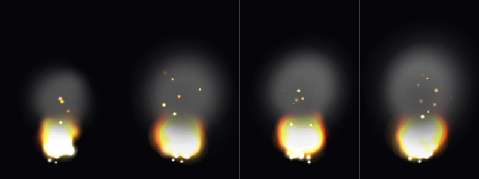

# Particle System - Fire & Smoke Simulation

CPU粒子系统，模拟真实的火焰和烟雾效果。

## 效果预览

### 火焰主视图（800x600）


### 时序演变图（4帧对比）


## 技术特点

### 粒子类型
- **火焰粒子 (FIRE)**: 核心火焰，加法混合，颜色从蓝白→黄→橙→暗红渐变
- **烟雾粒子 (SMOKE)**: Alpha混合，由深灰渐变为透明，随时间扩散变大
- **火星粒子 (EMBER)**: 加法混合，从发射器飞散，受重力影响抛物线轨迹

### 渲染技术
- **软粒子（高斯衰减）**: 使用 `exp(-t²×3)` 衰减函数，避免硬边界
- **加法混合 (Additive Blending)**: 火焰叠加产生自然的光晕效果
- **Alpha混合**: 烟雾层叠产生真实的透明度渐变
- **辉光效果**: 简单的亮像素扩散模拟光晕

### 物理模拟
- **浮力**: 火焰粒子受温度驱动的浮力（向上）
- **重力**: 火星粒子受重力影响
- **湍流**: 基于噪声函数的湍流扰动，使火焰自然摇曳
- **风力**: 正弦函数模拟周期性风力
- **阻尼**: 速度衰减防止粒子无限加速

### 颜色渐变（火焰生命周期）
```
life=1.0 → 蓝白 (1.0, 1.0, 1.0)    ← 刚出生（热核心）
life=0.85 → 黄白 (1.0, 0.95, 0.6)
life=0.65 → 橙色 (1.0, 0.55, 0.1)
life=0.40 → 橙红 (0.8, 0.15, 0.02)
life=0.15 → 暗红 (0.3, 0.0, 0.0)
life=0.0  → 消失 (0.0, 0.0, 0.0)    ← 死亡
```

## 编译运行

```bash
# 需要：g++ (C++17), stb_image_write.h
g++ main.cpp -o particle_system -std=c++17 -O2 -Wno-missing-field-initializers
./particle_system
```

## 输出结果

| 文件 | 尺寸 | 描述 |
|------|------|------|
| `fire_output.png` | 800x600 | 3秒预热后的稳定火焰帧 |
| `fire_sequence.png` | 800x300 | 4帧时序演变对比图 |

## 量化验证结果

- ✅ 高亮像素（亮度>200）: **23,604个**
- ✅ 非黑像素占比: **11.2%**（>3%阈值）
- ✅ 火焰区域R > B（正确的橙红色调）
- ✅ 四帧亮度递增: `26.8 → 36.5 → 38.0 → 41.4`
- ✅ 发射器区域最大亮度: **255**

## 技术总结

1. **粒子系统架构**: 将粒子按类型分层渲染很关键——先烟雾(Alpha混合)，再火焰(加法混合)，最后火星
2. **加法混合的魔力**: 多个半透明粒子叠加后自然形成明亮的核心，无需手动计算亮度
3. **噪声函数**:简单的 `sin(x*k)` 哈希噪声足以制造自然的湍流效果
4. **性能**: 1000粒子 × 3秒预热 = 180帧模拟，CPU耗时仅 **0.1秒**，非常高效

---
**完成时间**: 2026-03-04 05:32  
**迭代次数**: 1次（一次编译通过）  
**编译器**: g++ (C++17)
