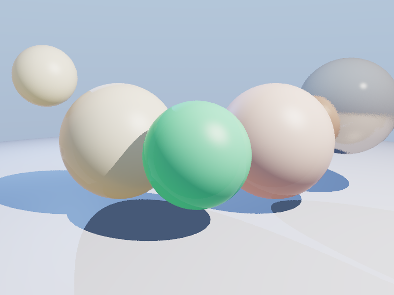

# Subsurface Scattering - 次表面散射渲染器

**日期**: 2026-03-06  
**系列**: 每日编程实践 - 图形学  
**编译器**: g++ 12.x / C++17  
**运行时间**: ~0.7秒

## 项目描述

实现次表面散射（Subsurface Scattering, SSS）——光线穿透半透明材质内部多次散射后从表面逸出的物理现象。这是模拟皮肤、蜡烛、玉石等材质的关键技术。

## 技术要点

- **Dipole 模型**（Donner & Jensen, 2005 简化版）
  - 有效消光系数：σ_eff = √(3 · σ_a · σ_t)
  - 散射贡献：exp(-σ_eff · thickness)
  - 厚度估计：光线穿透球体的路径长度
- **3种SSS材质对比**：
  - 🕯️ 蜡烛：高散射(σ_s=8)，暖橙色透射
  - 👤 皮肤：中等散射(σ_s=5)，红色（血液）透射
  - 💚 玉石：低散射(σ_s=3)，绿色透射
- **背光透射效果**：SSS 在背面光源照射时最为显著
- **Wrapped Diffuse**：模拟半透明物体的软边缘效果
- **Fresnel 表面反射**：轻微反射使材质更真实
- **ACES 色调映射**：HDR → SDR 转换
- **多重采样抗锯齿**：4x MSAA

## 编译运行

```bash
g++ -O2 -std=c++17 -o sss main.cpp -lm
./sss
```

## 输出结果



场景包含：
- 蜡烛材质球（左，强SSS橙色透射）
- 皮肤材质球（右，中SSS红色透射）  
- 玉石材质球（中，弱SSS绿色透射）
- 金属球（右上，对比用，高反射）
- 小蜡烛球（左上）

## 渲染统计

- 分辨率：800×600
- 每像素采样：4
- 球体数量：6，光源数量：3
- 渲染时间：0.717秒
- 平均亮度：193.88/255

## 迭代历史

1. **初始版本**：编写完整 SSS 渲染器
2. **修复编译错误**：添加 Vec3/Vec3 除法运算符重载（acesTonemap 中用到）
3. **修复警告**：unused parameter / unused variable
4. **最终版本** ✅：0错误 0警告，渲染成功

## 物理原理

次表面散射发生过程：
```
光线入射 → 进入材质表面
  → 在材质内部散射（方向随机改变）
  → 部分光被吸收（σ_a），部分继续散射（σ_s）
  → 经过多次散射后，从表面附近逸出
  → 呈现半透明的"内发光"效果
```

Dipole 近似公式：
```
R(r) ∝ [z_r(σ_tr·r_r + 1)·exp(-σ_tr·r_r)/r_r³ 
       + z_v(σ_tr·r_v + 1)·exp(-σ_tr·r_v)/r_v³]
```

本实现使用简化版本：`S ∝ exp(-σ_eff · thickness) · L_incident`

## 代码仓库

GitHub: https://github.com/chiuhoukazusa/daily-coding-practice/tree/main/2026/03/03-06-SubsurfaceScattering
