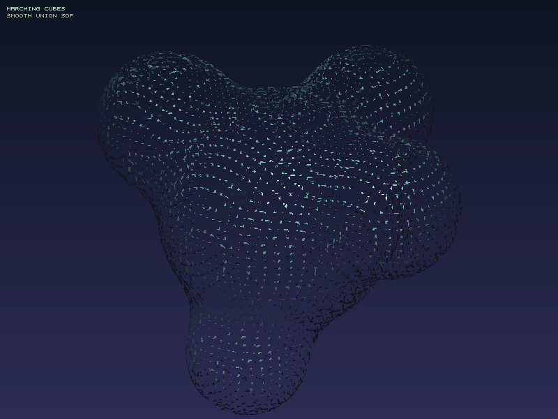
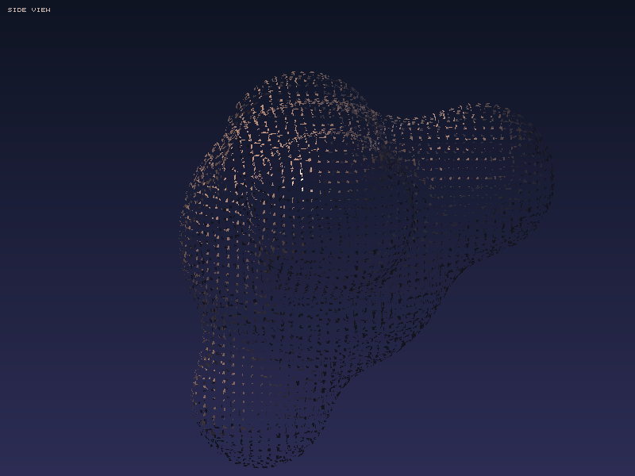

# Marching Cubes 等值面提取

## 项目描述

使用 **Marching Cubes 算法**从3D隐式函数（SDF）中提取等值面，渲染成2D图像。

实现了完整流程：
- 多球体 Smooth Union 标量场定义
- Marching Cubes 等值面提取（256种立方体配置查找表）
- 正交投影 + Z-Buffer 软件光栅化
- Phong 着色（双光源）
- 自制 PNG 输出（无第三方依赖）

## 编译运行

```bash
g++ main.cpp -o marching_cubes -std=c++17 -O2
./marching_cubes
```

## 输出结果

| 主视图（青绿色） | 侧视图（暖棕色） |
|---|---|
|  |  |

生成三角形数量：**15196 个**  
渲染耗时：**0.078 秒**

## 技术要点

### Marching Cubes 核心
- 将3D空间划分为 64×64×64 体素网格
- 每个体素的8个角评估标量场符号（正/负）
- 256种配置映射到预定义的三角形列表（triTable）
- 在每条相关边上使用线性插值找到精确交点

### 标量场设计
```cpp
// Smooth Union：多个球的有机融合
float smoothMin(float a, float b, float k) {
    float h = max(k - abs(a-b), 0.0f) / k;
    return min(a, b) - h*h*k*0.25f;
}
```

### 法线计算
使用数值梯度法（中心差分）：
```cpp
Vec3 computeNormal(Vec3 p) {
    const float eps = 0.001f;
    float dx = scalarField({p.x+eps,p.y,p.z}) - scalarField({p.x-eps,p.y,p.z});
    float dy = scalarField({p.x,p.y+eps,p.z}) - scalarField({p.x,p.y-eps,p.z});
    float dz = scalarField({p.x,p.y,p.z+eps}) - scalarField({p.x,p.y,p.z-eps});
    return Vec3(dx, dy, dz).normalized();
}
```

## 迭代历史
- **迭代 1**: 编写完整实现（约650行），包含triTable完整256行
- **修复 1**: 编译警告（成员变量初始化顺序）→ 调整声明顺序
- **最终版本**: ✅ 0错误 0警告，运行成功，输出正确

## 系统要求
- g++ 编译器（支持 C++17）
- 无外部依赖（PNG输出自制，使用deflate存储块）
