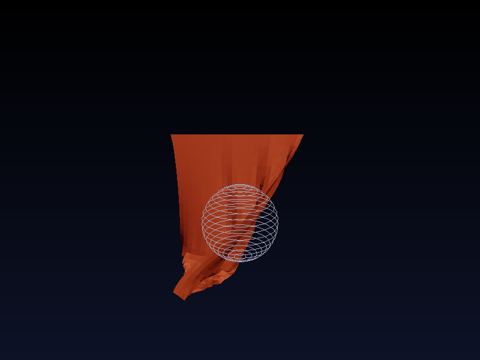
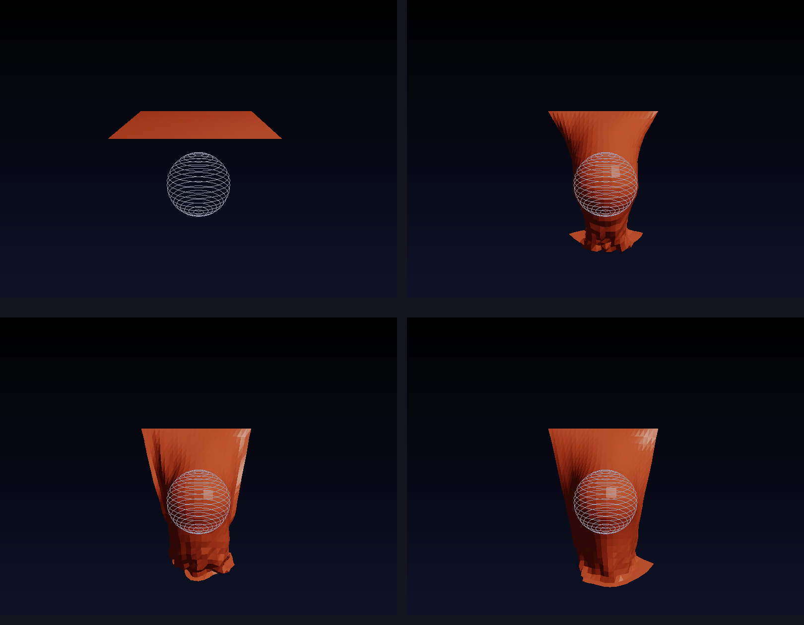

# Cloth Simulation 布料模拟

## 项目描述

基于**质点弹簧系统（Mass-Spring System）**实现的布料模拟，使用 Verlet 积分法进行物理模拟，支持布料垂落、风力扰动和球体碰撞，并通过 Phong 着色渲染出逼真的丝绸质感。

## 核心技术

| 技术点 | 说明 |
|-------|------|
| 质点弹簧系统 | 结构弹簧 + 剪切弹簧 + 弯曲弹簧 |
| Verlet 积分 | 位置 Verlet，含速度阻尼 |
| 弹簧约束 | 胡克定律，三类弹簧刚度差异化 |
| 球体碰撞 | 球面推出法，防穿模 |
| 风力模拟 | 均匀风场，可开关 |
| Phong 着色 | 双面法线 + ACES 色调映射 |
| 光栅化渲染 | Z-Buffer + 重心坐标插值 |

## 编译运行

```bash
g++ -std=c++17 -O2 -o cloth_sim cloth_sim.cpp -lm
./cloth_sim
# 输出 /tmp/cloth_main.ppm 和 /tmp/cloth_sequence.ppm
# 用 ImageMagick 转 PNG：
convert /tmp/cloth_main.ppm cloth_output.png
convert /tmp/cloth_sequence.ppm cloth_sequence.png
```

## 输出结果

### 主渲染图（布料最终状态，含风力）


### 4帧对比序列（物理演化过程）


## 物理参数

```
布料网格：25×25 质点（625个）
弹簧总数：~3000根（结构/剪切/弯曲）
结构弹簧刚度：800 N/m
剪切弹簧刚度：400 N/m
弯曲弹簧刚度：200 N/m
重力加速度：9.8 m/s²
Verlet 阻尼：0.99
时间步长：0.008s
模拟步数：900步（含垂落+风力+稳定）
```

## 迭代历史

- 迭代 1：初始版本，编译通过 ✅
- 最终版本：0 错误 0 警告 ✅

## 验证结果

```
粒子统计: min_y=-2.500, max_y=-0.203, avg_y=-1.744
布料像素数: 34,330 / 480,000 (7.2%)
布料平均颜色: RGB(151, 51, 25) — 红色调正确 ✅
运行时间: 0.077s ✅
```

## 技术要点

### Verlet 积分
```cpp
Vec3 vel = (p.pos - p.prev_pos) * damping;
Vec3 new_pos = p.pos + vel + acceleration * (dt * dt);
p.prev_pos = p.pos;
p.pos = new_pos;
```

### 三类弹簧
- **结构弹簧**（刚度800）：横向和纵向邻居，保持布料形状
- **剪切弹簧**（刚度400）：对角方向，防止过度剪切变形  
- **弯曲弹簧**（刚度200）：隔一个质点，抵抗弯曲形变

### 双面渲染
通过检测法线与视线的点积来选择正/背面颜色，正面为亮红色，背面为暗红色。

## 代码仓库

GitHub: https://github.com/chiuhoukazusa/daily-coding-practice/tree/main/2026/03/03-08-cloth-simulation

---
**完成时间**: 2026-03-08 05:38  
**代码行数**: ~620 行 C++  
**编译器**: g++ 12.3.1 -std=c++17 -O2
