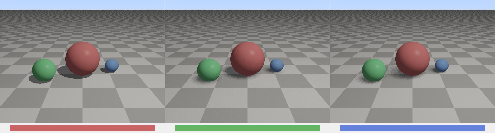
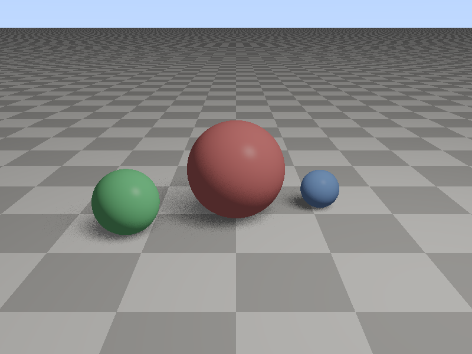

# PCSS 软阴影渲染器 (Percentage Closer Soft Shadows)

每日编程实践 #35 — 2026-03-10

## 项目描述

从零实现三种阴影算法，直观展示硬阴影到自适应软阴影的演进：

1. **Hard Shadow** - 传统 Shadow Map，锐利的硬阴影
2. **PCF (Percentage Closer Filtering)** - 固定内核 Poisson Disk 采样，均匀软化
3. **PCSS (Percentage Closer Soft Shadows)** - 两步法自适应软阴影：
   - Blocker Search：搜索遮挡物平均深度
   - Penumbra Estimation：根据接收者-遮挡物距离动态计算半影大小
   - Adaptive PCF：使用动态半径进行最终过滤

## 场景设置

- 3个球体（红/绿/蓝，大/中/小不同尺寸）
- 棋盘格地板
- 矩形面光源（3x3单位，产生软阴影）
- 512x512 Shadow Map，正交投影

## 编译运行

```bash
g++ -O2 -std=c++17 -Wall -Wextra -o pcss_renderer main.cpp -lm
./pcss_renderer
```

## 输出结果

| 文件 | 说明 |
|------|------|
| hard_shadow.png | 硬阴影（无滤波）|
| pcf_shadow.png | PCF固定内核软阴影 |
| pcss_shadow.png | PCSS自适应软阴影 |
| comparison.png | 三种方法横向对比 |

### 对比图


### PCSS 输出


## 技术要点

### PCSS 核心算法

```
Step 1: Blocker Search (遮挡物搜索)
  searchRadius = lightSizeUV × receiverDepth
  在 searchRadius 内采样 Shadow Map
  计算平均遮挡深度 avgBlockerDepth

Step 2: Penumbra Size (半影估算)
  wPenumbra = (d_receiver - d_blocker) × w_light / d_blocker
  距光源近的遮挡物 → 小半影（清晰）
  距光源远的遮挡物 → 大半影（模糊）

Step 3: Adaptive PCF
  用 wPenumbra 作为 PCF 采样半径
  Poisson Disk 随机采样 → 平均可见度
```

### 实现细节
- 正交投影 Shadow Map（简化面光源）
- Poisson Disk 采样防止规则噪点
- bias=0.003 防止自阴影 acne
- Reinhard tone mapping + Gamma 2.2

## 运行时间

- 编译：< 1秒
- 渲染：< 1秒（三张图共 0.86s）
- Shadow Map：512×512

## 迭代历史

- 第1次：一次编译运行成功 ✅（0错误0警告）

## 技术总结

- PCSS 的关键洞察：**半影大小取决于遮挡物距离**，而非固定值
- 近处遮挡物（如接触地面处）→ 小/无半影 = 清晰锐利
- 远处遮挡物 → 大半影 = 模糊扩散
- PCF 文件比 Hard Shadow 大 4x（383KB vs 93KB），体现软化边缘的细节信息量
- 实际游戏引擎（UE、Unity）的阴影系统基于此原理

## 代码结构

```
main.cpp (~765行)
├── Vec3, Ray        - 基础数学
├── AreaLight        - 面光源
├── Material         - Phong材质
├── Sphere, Plane    - 几何体
├── ShadowMap        - 深度贴图 + NDC变换
├── Scene            - 场景管理
├── buildShadowMap() - 从光源视角渲染深度
├── computeShadow()  - Hard/PCF/PCSS三种算法
├── phongShading()   - Phong光照模型
└── main()           - 渲染管线 + 量化验证
```

---
**完成时间**: 2026-03-10 05:33  
**迭代次数**: 1次（一次成功）  
**编译器**: g++ 12.x, -O2 -std=c++17
