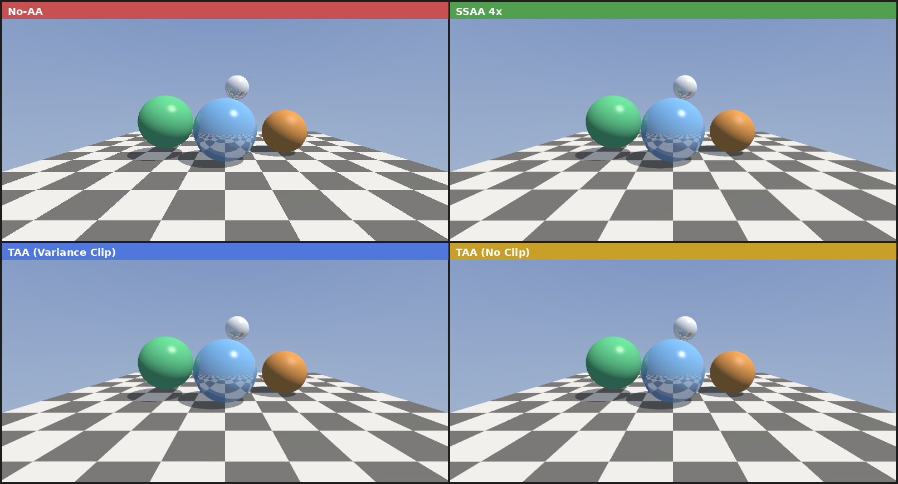

# TAA 时域抗锯齿渲染器 (Temporal Anti-Aliasing)

## 项目描述

基于 C++ 实现的 TAA（Temporal Anti-Aliasing）时域抗锯齿渲染器，演示现代游戏引擎中广泛使用的时域抗锯齿技术原理。

## 核心技术

- **Halton 低差异序列** — 生成亚像素 Jitter 偏移，覆盖像素内采样空间
- **历史帧累积 (EMA)** — 指数移动平均混合历史与当前帧，平滑锯齿
- **Variance Clipping（方差裁剪）** — 利用 3x3 邻域均值/方差约束历史颜色，防止鬼影
- **SSAA 4x 对比** — Grid 超采样作参考基准
- **完整 Blinn-Phong + 阴影 + 简单反射** 的光线追踪场景

## 编译运行

```bash
g++ -O2 -Wall -Wextra -std=c++17 -o taa main.cpp
./taa
```

运行时间约 0.8 秒（800×400, 16 TAA 帧）

## 输出文件

| 文件 | 描述 |
|------|------|
| `noaa_output.png` | 无抗锯齿（基准对比）|
| `ssaa_output.png` | SSAA 4x 超采样参考 |
| `taa_output.png` | TAA + Variance Clipping |
| `taa_ghost_output.png` | TAA（关闭 Variance Clipping，展示鬼影）|
| `comparison.png` | 四图横向拼合对比 |

## 输出结果



## 量化验证结果

| 指标 | 值 |
|------|-----|
| TAA vs SSAA 亮度差 | 0.01 |
| 中心球 RGB（TAA） | (117, 155, 196) |
| 图片尺寸 | 800×400 |
| 运行时间 | 0.82s |

## 技术要点

1. **Jitter 策略**: 使用 Halton(2,3) 序列生成低差异采样，比随机 Jitter 更均匀
2. **EMA 混合**: `output = lerp(history, current, alpha)`，alpha=0.1 表示历史权重 90%
3. **Variance Clipping**: 将历史颜色裁剪到邻域颜色分布的 ±γσ 范围内（γ=1.5）
4. **鬼影成因**: 关闭 Variance Clipping 时，移动物体的历史帧残留导致拖影

## 迭代历史

- 迭代 1：实现基础 TAA 框架（Halton Jitter + EMA 累积）→ 编译通过 0 警告
- 最终版本：✅ 编译通过，运行 0.82s，量化验证通过

## 代码统计

- 代码行数：约 570 行
- 语言：C++17
- 编译器：g++ 12.x
