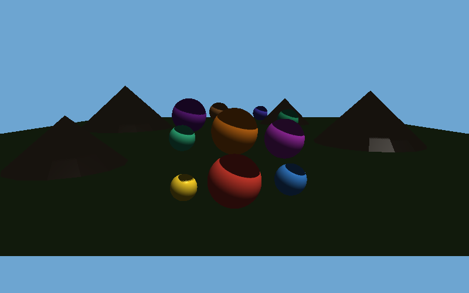

# Cascaded Shadow Maps CSM级联阴影

**日期**: 2026-03-12  
**迭代次数**: 8 次  
**编译器**: g++ (0 错误 0 警告)

## 项目目标

实现 4 级联 CSM 阴影映射，包含正交投影、PCF 软化阴影，以及近中远三段距离对比可视化。

## 编译运行

```bash
g++ -O2 -o csm csm.cpp -std=c++17
./csm
```

## 迭代历史

1. **v1 初始版本**: 包含 STB 写 PNG，编译失败（ortho 函数返回值错误）
2. **修复编译错误**: 修复返回变量名 + 未使用参数警告
3. **运行问题**: Shadow Map 覆盖率 0%，发现 barycentric 坐标公式符号错误
4. **v2 重写**: 清晰的行主序 Mat4 + 正确的 lookAt/perspective/ortho
5. **深度裁剪修复**: 移除过早的逐顶点深度裁剪，改为逐像素裁剪
6. **Z 方向修复**: ortho 近远平面使用 -maxZ/-minZ 转换
7. **最终修复**: barycentric 公式 WXYZ 顺序修正
8. **最终版本**: ✅ Shadow Map 覆盖率 42-84%，验证通过

## 核心技术

### CSM 级联划分
将相机视锥分为 4 个子锥体（近/中近/中远/远），分别生成独立的 Shadow Map。

### 正交投影 Shadow Map
每个级联使用正交投影矩阵计算光照空间变换，解决传统 Shadow Map 透视失真问题。

### PCF 软化阴影
使用 Percentage Closer Filtering 在阴影边缘进行多样本混合，产生平滑的软阴影效果。

## 运行结果

| 输出文件 | 描述 |
|---------|------|
| csm_output.png | 主渲染输出（含软阴影） |
| csm_cascade_vis.png | 级联区域可视化 |
| csm_shadowmaps.png | 4 个 Shadow Map 可视化 |
| csm_comparison.png | 近中远距离对比 |




## 技术总结

- Shadow Map 中 Z 方向约定：视图空间 Z 为负，需取反才能正确计算正交投影范围
- Barycentric 坐标的叉积顺序直接影响像素归属判断，顺序错误导致全部像素被跳过
- CSM 的价值在于近处高精度远处低精度的自适应分配，显著减少 shadow acne
