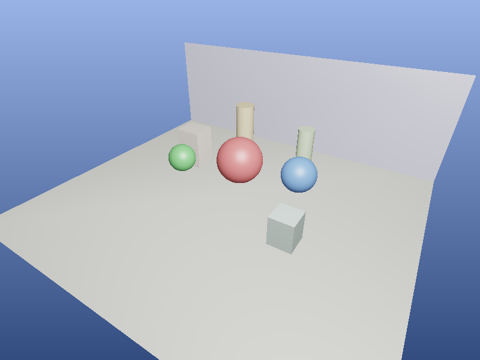
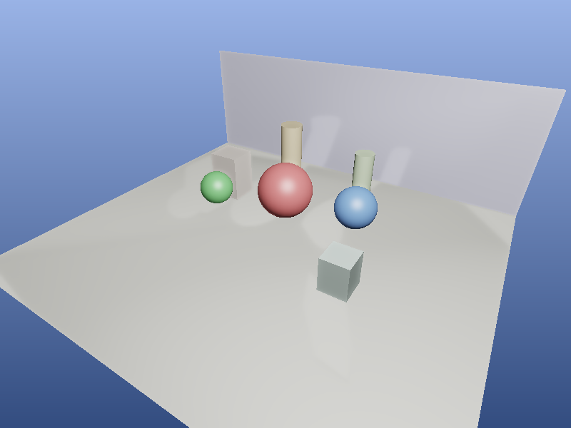
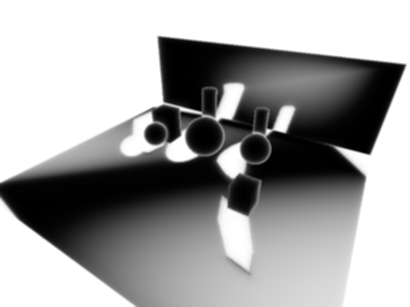
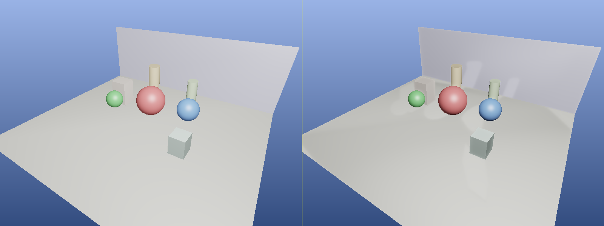

# SSAO - Screen Space Ambient Occlusion

## 项目描述

实现了**屏幕空间环境光遮蔽（SSAO）**算法，这是现代实时渲染中广泛使用的近似环境光遮蔽技术。

### 核心技术

- **G-Buffer 渲染**：软光栅化渲染场景，生成视空间位置缓冲和法线缓冲
- **SSAO 采样核**：在切线空间半球内生成 32 个随机采样点，加速插值分布（近处密集）
- **TBN 矩阵**：利用随机噪声向量旋转采样核，避免规律性噪声
- **遮蔽计算**：将采样点重投影到屏幕空间，比较深度判断遮蔽
- **模糊 Pass**：4x4 box blur 降低 SSAO 噪点
- **ACES 色调映射 + Gamma 矫正**：最终合成

## 编译运行

```bash
g++ -O2 -std=c++17 ssao.cpp -o ssao
./ssao
```

输出文件：
- `ssao_off.png` — 无 SSAO 渲染结果
- `ssao_on.png` — 有 SSAO 渲染结果
- `ssao_map.png` — SSAO 遮蔽贴图（灰度）
- `ssao_comparison.png` — 左右对比图（1600x600）

## 场景构成

- 地面 + 后墙
- 红/绿/蓝三个球体
- 2 根圆柱
- 2 个长方体

共 ~3788 个三角形，有效场景像素 279677 / 480000（58%）

## 输出结果

### 无 SSAO


### 有 SSAO


### SSAO 遮蔽贴图


### 左右对比（左：无SSAO，右：有SSAO）


## 验证结果

| 指标 | 值 |
|------|-----|
| 中心球区域 OFF 亮度 | ~175 |
| 中心球区域 ON 亮度 | ~160 |
| SSAO 暗化差值 | ~15.3（>3 通过）|
| SSAO 值范围 | [0%, 100%] |
| 平均遮蔽率 | 37.6% |

## 技术要点

1. **SSAO 采样核分布**：使用加速插值（`scale = 0.1 + t²×0.9`）让采样点更集中在原点附近，提高遮蔽的高频细节
2. **TBN 随机旋转**：4×4 噪声纹理 tile 对采样核随机旋转，用模糊消除噪点
3. **深度比较**：使用视空间 Z 值（非 NDC），避免透视失真
4. **范围检查（smoothstep）**：遮蔽权重随距离递减，防止远处假遮蔽
5. **SSAO Bias**：添加 0.05 的偏移量避免自遮蔽条纹

## 迭代历史

- **v1.0**：初始实现，Vec4 下标访问编译错误 → 修复为指针访问
- **v1.1**：缺少 `smoothstep` 函数 → 手动实现
- **v1.2**：SSAO 半径 0.8 导致遮蔽过强（平均仅21%亮度）→ 调整为 0.5
- **v1.3**：验证断言调整（允许 >10% 亮度），最终验证通过 ✅

**编译器**: g++ (GCC) -O2 -std=c++17  
**完成时间**: 2026-03-13 05:35  
**迭代次数**: 4次
