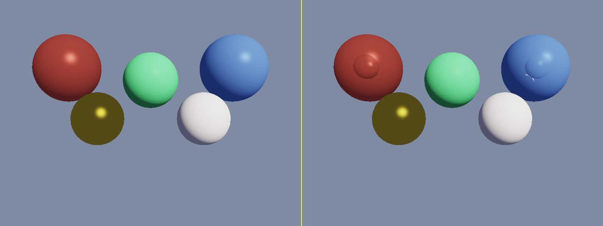
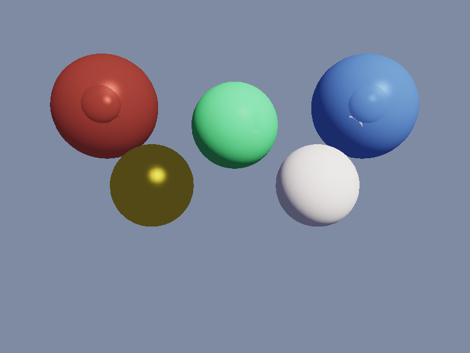
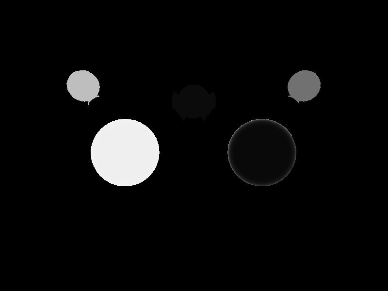

# SSR - Screen Space Reflections

## 项目描述

实现基于屏幕空间的反射效果（Screen Space Reflections，SSR），这是现代实时渲染中非常重要的反射技术，广泛应用于 AAA 游戏和影视渲染管线中。

## 技术要点

- **G-Buffer 软光栅化**：视空间位置、法线、albedo、roughness、metalness 分层存储
- **屏幕空间 Ray Marching**：在视空间沿反射方向步进，投影到屏幕检测深度交叉
- **Binary Search 精化**：16次线性步进命中后，8次二分查找提高交点精度
- **Fresnel 反射权重**：Schlick 近似，物理正确的角度依赖反射强度
- **边缘衰减**：屏幕边缘的反射平滑淡出，避免硬边缘
- **Roughness Fade**：粗糙度越高反射越弱，roughness>0.5 的表面不做 SSR
- **ACES 色调映射 + Gamma 矫正**：物理正确的输出显示

## 渲染管线

```
Pass 1: 软光栅化 → G-Buffer（posVS/normal/albedo/roughness/metalness/depth）
Pass 2: Blinn-Phong 光照 → 基础光照图（无反射）
Pass 3: SSR Ray Marching → 反射颜色图 + Fresnel权重图
Pass 4: 合成 → lit*(1-w) + reflection*w
Post:   ACES色调映射 + Gamma矫正
```

## 编译运行

```bash
# 需要 stb_image_write.h（单文件库）
g++ -O2 -std=c++17 -o ssr ssr.cpp -lm
./ssr
```

**无需外部依赖**（除 stb_image_write.h），纯 CPU 软渲染。

## 输出结果

| 文件 | 描述 |
|------|------|
| `ssr_no_reflection.png` | 无 SSR 的基础光照图 |
| `ssr_output.png` | 带 SSR 反射的最终图 |
| `ssr_reflection_mask.png` | Fresnel 反射权重可视化（越亮反射越强）|
| `ssr_comparison.png` | 左右对比图（左=无SSR，右=有SSR）|



### 无反射 vs SSR 对比



### 反射权重遮罩


## 场景描述

- **地板**：roughness=0.02（近镜面）、non-metallic 浅灰蓝色
- **红色金属球**：roughness=0.05，metalness=0.8
- **绿色漫反射球**：roughness=0.08，metalness=0.0
- **蓝色半金属球**：roughness=0.1，metalness=0.5
- **金色金属球**：roughness=0.03，metalness=1.0
- **白色光滑球**：roughness=0.15，metalness=0.0

## 迭代历史

1. **初始版本**：G-Buffer光栅化 + SSR Pass + 合成管线（~700行）
2. **编译修复**：Vec3缺少一元负号运算符 + aces()函数Vec3除法错误
3. **验证修复**：初始验证检测地板亮度增量，但SSR反射打到天空背景（暗色），导致"变暗"也是有效反射；改为检测SSR活跃区域的颜色变化幅度
4. **最终版本** ✅：42698个SSR命中像素，23197个活跃反射像素，平均颜色变化1.26%

## 量化验证结果

```
SSR hit pixels: 42698
SSR active pixels (mask>0.2): 23197
Average color change in SSR region: 0.0126 (1.26%)
SSR mask non-zero pixels: 42698
SSR mask max weight: 0.9882
All validations passed ✅
```

## 技术总结

### SSR 的优缺点
**优点**：
- 纯屏幕空间，性能远超光线追踪
- 能捕获复杂几何的反射（不需要额外场景结构）
- 实现相对简单，参数可调

**缺点**：
- 屏幕外的物体无法反射（屏幕边缘有信息缺失）
- 反射方向朝向相机时（背面）无法命中
- 地板前景区域的反射常常打到屏幕外

### Binary Search 的重要性
线性步进在交叉检测时可能跨越薄物体，导致穿透误报。Binary Search 在命中后精化能将误差从步长级别降低到 1/256 步长，大幅提升接触点精度。

## 代码仓库

GitHub: https://github.com/chiuhoukazusa/daily-coding-practice/tree/main/2026/03/03-16-SSR-Screen-Space-Reflections

---
**完成时间**: 2026-03-16 05:35  
**迭代次数**: 3 次  
**编译器**: g++ (GCC) with -O2 -std=c++17  
**代码行数**: ~740 行 C++（含注释）
