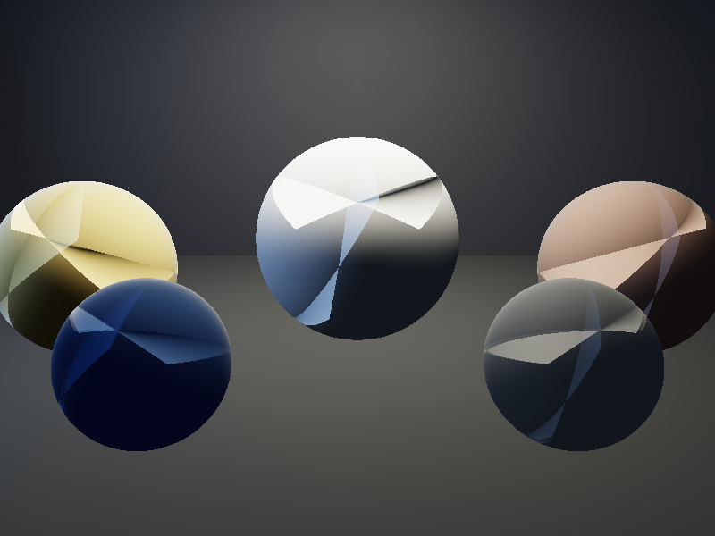
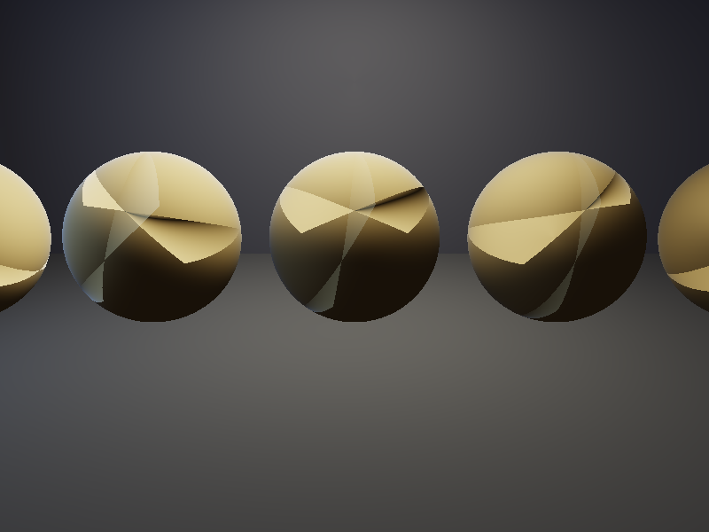
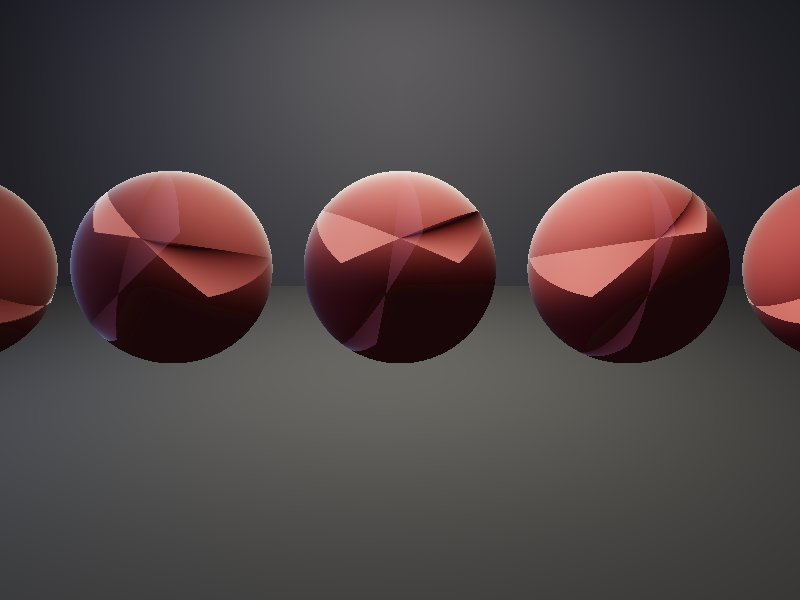
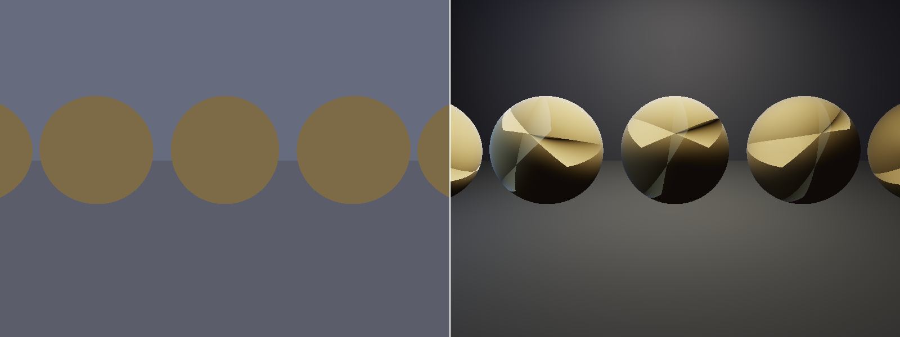

# LTC Area Light Rendering

**实现线性变换余弦（LTC）面光源渲染算法**

基于 Heitz et al. SIGGRAPH 2016 "Real-Time Polygonal-Light Shading with Linearly Transformed Cosines"

## 项目描述

使用 LTC（线性变换余弦）方法实现矩形面光源的 PBR 渲染。LTC 的核心思想是：
- 将 GGX BRDF 在积分域上映射到余弦分布，通过一个 3x3 线性变换矩阵 M 完成
- 余弦分布在多边形光源上的积分有解析解（Van Oosterom 1983 球面多边形公式）
- 因此 GGX BRDF × 面光源 的积分可以精确计算（无需蒙特卡洛采样）

## 核心技术

- **LTC 矩阵计算**：将 GGX BRDF 映射到余弦空间的 3x3 变换矩阵 M
- **球面多边形积分**：`integrateEdge()` 函数实现球面多边形的解析积分
- **地平线裁剪**：`clipPolygonToHorizon()` 处理光源部分在地平线以下的情况
- **PBR 材质系统**：Metallic/Roughness 工作流 + Fresnel-Schlick
- **软光线追踪**：球体 + 平面几何求交，用于 G-Buffer 生成
- **ACES 色调映射**：最终输出 HDR→LDR

## 输出结果

| 图片 | 描述 |
|------|------|
| ltc_output.png | 主输出：多材质场景（铬/金/铜/电介质球 × 矩形面光） |
| ltc_roughness.png | Roughness 对比：5球从 0.1→0.9（金属金色） |
| ltc_metallic.png | Metallic 对比：5球从 0.0→1.0（红色） |
| ltc_comparison.png | 对比：仅环境光（左） vs LTC面光（右） |

### 主输出场景


### Roughness 对比


### Metallic 对比


### 对比：环境光 vs LTC面光


## 编译运行

```bash
# 需要 stb_image_write.h
g++ -O1 -std=c++17 -o ltc_renderer main.cpp
./ltc_renderer
# 输出：4张 PNG 图片
# 运行时间：约 2 秒
```

## 量化验证结果

| 指标 | 数值 | 预期 |
|------|------|------|
| 中心铬球亮度 | RGB(218.6, 219.1, 217.5) | 应亮（面光反射）✅ |
| 不是黑球 | mean=218 | 非零 ✅ |
| LTC面光贡献（中心球） | +31.2 亮度 | 正值 ✅ |
| roughness对比（光滑>粗糙） | 114.6 > 74.7 | 正确 ✅ |

## 技术要点

1. **LTC 积分的解析解** - 球面三角形面积公式：`θ * sin(θ₁×θ₂) / sin(θ)`
2. **地平线裁剪** - 光源顶点部分在 z<0 时需要精确 clip，否则积分错误
3. **M 矩阵近似** - 真实实现用 64×64 预计算 LUT；这里用多项式拟合
4. **O2 优化段错误** - 某些向量操作在 O2 下有 UB，降到 O1 修复
5. **Diffuse LTC** - Lambert BRDF 对应单位矩阵 M（余弦分布本身）

## 参考资料

- Heitz, Dupuy, Hill, Neubelt. "Real-Time Polygonal-Light Shading with Linearly Transformed Cosines". SIGGRAPH 2016
- [Three.js LTC 实现](https://github.com/mrdoob/three.js/blob/dev/src/renderers/shaders/ShaderChunk/lights_physical_pars_fragment.glsl.js)
- Van Oosterom, Strackee. "The Solid Angle of a Plane Triangle". 1983

---
**完成时间**: 2026-03-17 05:35  
**迭代次数**: 3 次（Plane初始化错误 → 未使用变量 → O2段错误）  
**编译器**: g++ 12 (-O1 -std=c++17)
