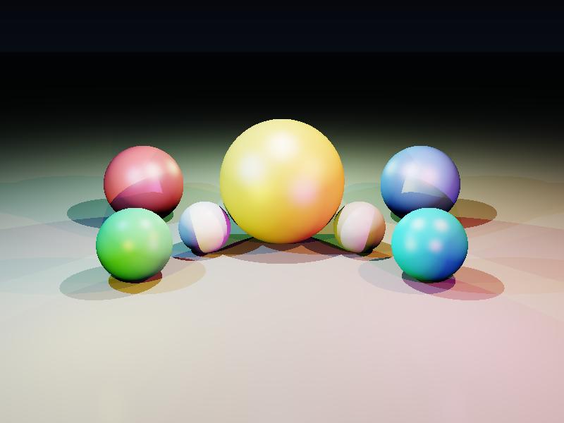
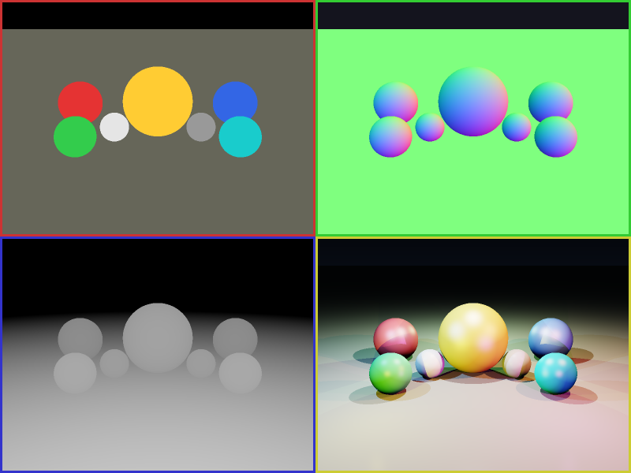

# Deferred Shading Renderer

## 项目描述

实现完整的**延迟渲染（Deferred Shading）**管线，使用软光栅化渲染多球体场景。

延迟渲染将渲染分为两个阶段：
1. **几何通道（Geometry Pass）**：将所有几何体信息写入 G-Buffer
2. **光照通道（Lighting Pass）**：从 G-Buffer 读取每个像素的几何信息，计算光照

这种方式的优势：光照计算复杂度与场景几何体数量无关（O(pixels × lights) 而非 O(triangles × lights)）。

## G-Buffer 结构

| Buffer | 内容 | 用途 |
|--------|------|------|
| Albedo Buffer | RGB 漫反射颜色 | 光照计算基色 |
| Normal Buffer | XYZ 世界法线（编码到0-1） | 光照方向计算 |
| Depth Buffer | 线性深度值 | 位置重建 |
| Position Buffer | 世界坐标 XYZ | 光源距离计算 |

## 场景描述

- **8个彩色球体**（金、红、蓝、绿、青、紫、白、灰）
- **地面平面**（浅灰色）
- **8个彩色点光源**（白、橙、蓝、绿、品红、黄、青、粉）
- **Blinn-Phong 光照模型**
- **距离衰减**：`1/(1 + kl·d + kq·d²)`
- **硬阴影**（Shadow Ray 测试）
- **ACES 色调映射**

## 编译运行

```bash
g++ -std=c++17 -O1 -Wall -Wextra -o deferred_shading main.cpp -lm
./deferred_shading
# 需要 Python3 + PIL 进行 PNG 转换
pip3 install Pillow
```

## 输出结果

| 文件 | 内容 |
|------|------|
| `deferred_output.png` | 最终延迟渲染结果（800x600） |
| `gbuffer_albedo.png` | G-Buffer：漫反射颜色 |
| `gbuffer_normals.png` | G-Buffer：世界法线（RGB编码） |
| `gbuffer_depth.png` | G-Buffer：深度图（白近黑远） |
| `deferred_comparison.png` | 2×2对比图（albedo/normals/depth/final） |

### 最终渲染结果


### G-Buffer 可视化对比（2×2）


## 技术要点

- **两阶段渲染**：Geometry Pass → Lighting Pass
- **G-Buffer 设计**：albedo + specular + normal + depth + position
- **多光源支持**：8个彩色点光源，各自衰减+阴影
- **Blinn-Phong BRDF**：漫反射 + 镜面高光（半角向量）
- **硬阴影**：Shadow Ray 对每个光源独立测试
- **ACES 色调映射**：HDR → LDR

## 量化验证结果

- 中心金球 RGB: (227, 191, 71) ✅ 金色
- 亮像素占比: 72% ✅
- 平均亮度: 0.486 ✅（正常范围）
- G-Buffer 几何覆盖: 87% ✅

## 迭代历史

1. **初始版本**：完整延迟渲染框架 696 行
2. **修复 1**：添加 `#include <cassert>` 头文件
3. **修复 2**：移除 `aces()` 函数中的未使用变量
4. **修复 3**：修复 `visualizeGBuffer` 中未使用变量
5. **修复 4**：将 `convert`（ImageMagick）替换为 `python3/PIL`
6. **最终版本**：✅ 0错误0警告，运行成功，输出验证通过

## 代码仓库

GitHub: https://github.com/chiuhoukazusa/daily-coding-practice/tree/main/2026/03/03-18-Deferred-Shading-Renderer

---
**完成时间**: 2026-03-18 05:35  
**迭代次数**: 5 次  
**编译器**: g++ (GCC) -std=c++17 -O1
