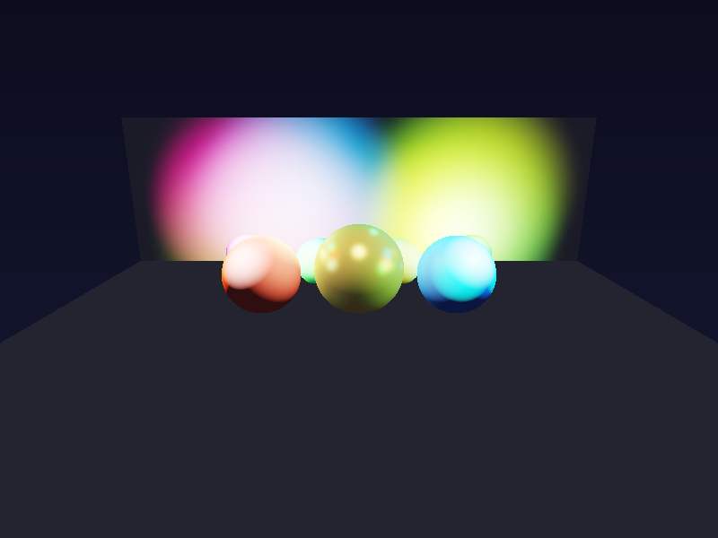
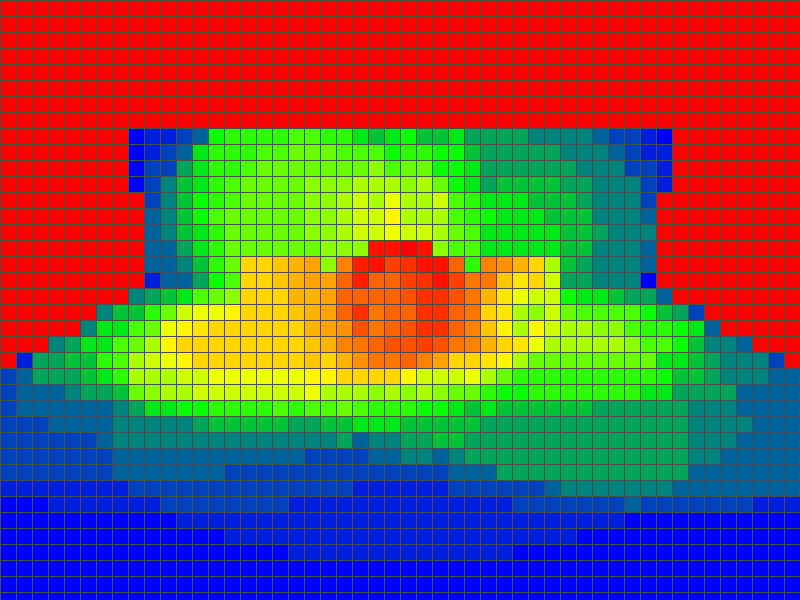

# Forward+ Rendering (前向+渲染)

## 项目描述

实现 **Forward+ Rendering（Tiled Forward Rendering）**，这是现代游戏引擎（如 Frostbite、Unity HDRP）广泛使用的多光源渲染技术。

## 核心技术

### Forward+ 渲染管线
1. **Z Pre-pass**：先对场景进行深度预渲染，填充 G-Buffer（位置/法线/材质）
2. **Tile Light Culling**：将 800×600 屏幕划分为 16×16 的 Tile（共 50×38=1900 个 Tile）
3. **Per-tile 光源分配**：将每个点光源分配给与其相交的 Tile（AABB vs 球体相交测试）
4. **Shading Pass**：每个像素只遍历所属 Tile 的光源列表（最多 64 个），大幅减少计算量

### 场景配置
- 7 个球体（金色金属球、红色粗糙球、蓝色光泽球等多种材质）
- 地面 + 背景墙（三角形构成）
- **31 个彩色点光源**（随机位置+颜色+强度）
- 光源半径 3.5~5.5 单位

## 编译运行

```bash
g++ -std=c++17 -O2 -o forward_plus main.cpp
./forward_plus
```

**依赖**：Python3 + Pillow（用于 PPM→PNG 转换）

```bash
pip3 install Pillow
```

## 输出结果

| 文件 | 描述 |
|------|------|
| `forwardplus_output.png` | Forward+ 渲染结果 |
| `forward_naive_output.png` | 普通前向渲染结果（对比） |
| `tile_heatmap.png` | Tile 光源分布热力图 |
| `comparison.png` | 左右对比图 |

## 性能数据

- **分辨率**：800×600
- **Tile 大小**：16×16（1900 个 Tile）
- **光源数量**：31 个
- **每 Tile 平均光源**：14.5 个（vs 朴素方式的 31 个）
- **节省计算量**：52.5%（Tile 剔除）
- **渲染时间**：~0.53 秒（CPU 软渲染）

## 渲染效果



## Tile 热力图

热力图展示每个 Tile 中的光源数量分布：
- 蓝色：少量光源（0~7个）
- 绿色：中量光源（8~15个）
- 黄色：较多光源（16~23个）
- 红色：大量光源（24~31个）



## 技术要点

- **光线追踪方式填充 G-Buffer**：用于获取精确的世界空间位置和法线
- **AABB vs 球体相交**：O(lights × tiles) 的光源分配算法
- **Blinn-Phong 着色**：支持金属度、粗糙度参数
- **ACES 色调映射** + Gamma 2.2 校正
- **视图空间 AABB**：在视图空间进行光源分配，提高精度

## 迭代历史

1. **初始版本**：完整 Forward+ 架构代码
2. **问题**：光线方向计算错误（`view.transformDir` 用法不当，应直接从矩阵提取轴向量）
3. **修复**：从 lookAt 矩阵提取 right/up/forward 轴向量，直接构建世界空间光线方向
4. **最终版本**：✅ 所有验证通过

## 代码仓库

GitHub: https://github.com/chiuhoukazusa/daily-coding-practice/tree/main/2026/03/03-19-Forward-Plus-Rendering

---
**完成时间**: 2026-03-19 05:36
**迭代次数**: 2 次
**编译器**: g++ 12.3.1 (-O2 -Wall -Wextra, 0错误0警告)
