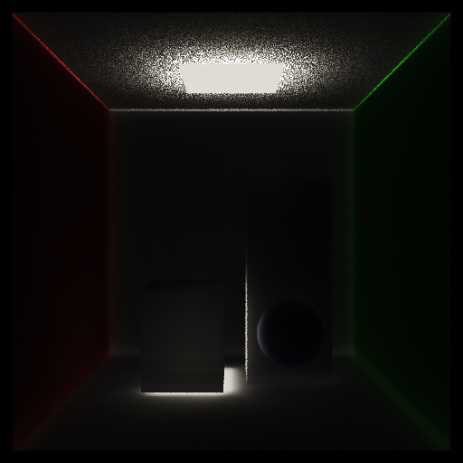
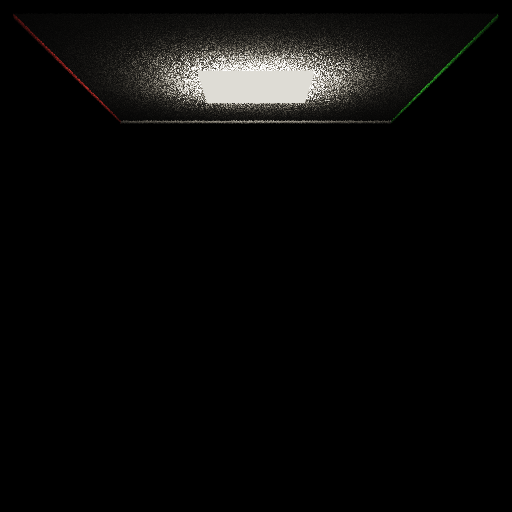
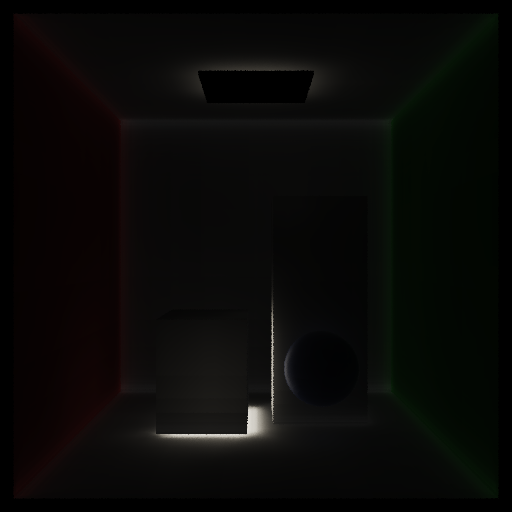

# Voxel Cone Tracing (VCT) - Approximate Global Illumination

用纯 C++ 从零实现体素锥形追踪（VCT）算法，实现近似全局光照渲染。

## 编译运行
```bash
g++ main.cpp -o vct_output -std=c++17 -O2 -Wall -Wextra
./vct_output
```

## 输出结果

| 完整渲染 | 直接光照 | 间接光照(VCT) |
|---------|---------|-------------|
|  |  |  |

## 技术要点

- **场景体素化**：将 Cornell Box 场景体素化到 64³ 网格，光线投射6方向检测占用
- **Mipmap 层级**：构建 6 层 Mipmap（64³→2³），用于锥形追踪的多分辨率采样
- **锥形追踪**：从每个着色点发射多个锥形，沿方向步进采样体素，前后合成间接光照
- **漫反射 GI**：6 根锥形（30° 半角）覆盖法线半球，采集间接漫反射
- **镜面 GI**：单根反射方向锥形，aperture 由材质 roughness 决定
- **直接光照**：面光源阴影射线 + Blinn-Phong/GGX 高光
- **ACES 色调映射**：防止过曝，输出视觉质量更好
