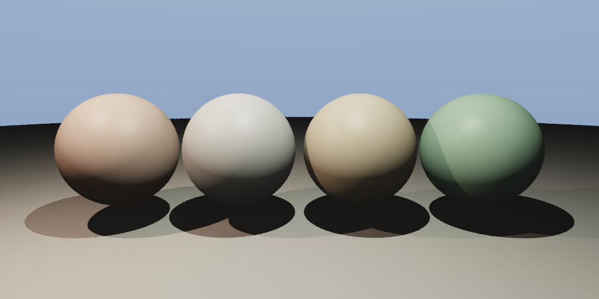

# Subsurface Scattering Renderer

次表面散射渲染器 —— 使用 Jensen 偶极子模型实现皮肤/大理石/蜡烛/玉石等半透明材质。

## 编译运行

```bash
g++ main.cpp -o output -std=c++17 -O2 -Wall -Wextra -lm
./output
```

## 输出结果



## 技术要点

- **Jensen 偶极子模型**：BSSRDF 的核心近似，虚拟光源法
- **漫射剖面 R_d(r)**：描述光子从入射点 xi 到出射点 xo 的扩散概率
- **多材质参数**：皮肤/大理石/蜡烛/玉石各具独特散射系数
- **Monte Carlo 表面积分**：在球面上均匀采样计算 SSS 贡献
- **ACES 色调映射**：高质量 HDR→LDR 转换
