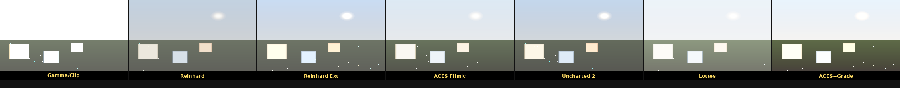

# HDR Tone Mapping & Color Grading

一个演示多种经典 HDR 色调映射算法的 CPU 渲染器，同时展示色彩分级技术。

## 编译运行

```bash
g++ main.cpp -o output -std=c++17 -O2
./output
```

需要 Python3 + Pillow 将 PPM 转换为 PNG：
```bash
python3 -c "from PIL import Image; [Image.open(f).save(f.replace('.ppm','.png')) for f in __import__('glob').glob('*.ppm')]"
```

## 实现的算法

| 算法 | 特点 |
|------|------|
| Gamma Only | 简单裁剪，高光爆掉 |
| Reinhard | 全局压缩，简单有效 |
| Reinhard Extended | 改进白点保护 |
| ACES Filmic | 工业标准，对比度强 |
| Uncharted 2 (Hable) | 游戏界最常用 |
| Lottes Filmic | 类似 ACES，曲线更柔 |
| ACES + Color Grade | 色彩分级演示 |

## 色彩分级技术

- **对比度调整**：S 形曲线，增强层次感
- **饱和度调整**：基于亮度的加权混合
- **色温调整**：暖/冷偏色
- **分色（Split Toning）**：阴影偏蓝、高光偏暖

## 输出结果

- `tonemap_comparison.png` — 7种算法并排对比图 (960×612)
- `tm_aces.png`、`tm_reinhard.png` 等 — 单独算法输出



## 技术要点

- HDR 场景包含宽动态范围：暗部 0.02、正常区 0.5、太阳 20+
- 所有映射在线性光照空间进行，最终 sRGB 伽马编码
- 量化验证：像素均值 10~240、标准差 > 5
