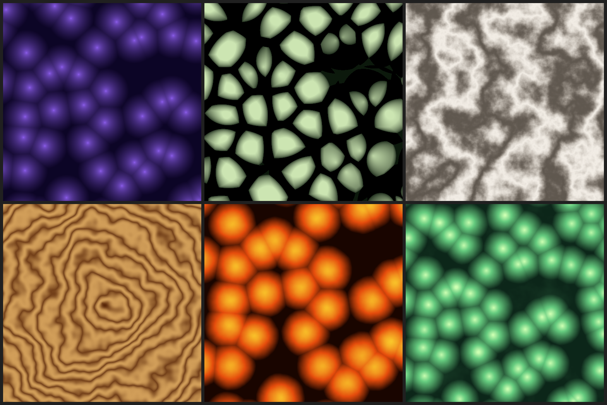

# Procedural Texture Synthesis

程序化纹理合成：基于 Worley 噪声 + Fractal Brownian Motion，生成多种有机纹理。

## 编译运行

```bash
g++ main.cpp -o output -std=c++17 -O2
./output
```

## 输出结果



## 生成的纹理

| 纹理 | 描述 |
|------|------|
| worley_f1.png | Worley F1 细胞纹理（蓝紫色调） |
| worley_edge.png | Worley F2-F1 边缘纹理（细胞边界高亮） |
| marble.png | 大理石纹理（Perlin + 正弦扰动） |
| wood.png | 木纹纹理（同心圆 + 噪声扰动） |
| lava.png | 熔岩/气泡纹理（反色 Worley + FBM） |
| organic.png | 有机细胞纹理（绿色细胞/生物膜） |

## 技术要点

- **Worley Noise**：计算到最近特征点的距离（F1、F2），生成 Voronoi 风格的细胞图案
- **F2-F1 边缘**：两个最近距离之差在细胞边界处最大，形成清晰的边界高亮
- **Perlin Noise + FBM**：多倍频叠加（6 octave），正弦函数扰动产生大理石纹脉
- **木纹**：以中心为基准的同心圆叠加低频噪声扰动，形成年轮感
- **哈希函数**：确定性整数哈希（无需随机数表），支持无限平铺
