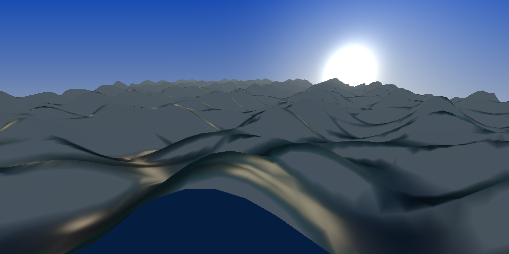

# Water Wave Simulation & Rendering

基于 **Gerstner Wave**（Trochoidal Wave）方程实现的多波叠加海面渲染器，采用软光栅化三角形网格，配合 Fresnel 反射、次表面散射近似和天空环境光。

## 编译运行

```bash
g++ main.cpp -o water_output -std=c++17 -O2
./water_output
```

需要 `stb_image_write.h`（位于上级目录）。

## 输出结果



## 技术要点

- **Gerstner Wave**：多组波叠加（5组不同方向/波长），顶点在 XZ 平面也产生水平位移，生成真实感波形
- **软光栅化**：网格三角形从远到近排序（Painter's Algorithm），重心坐标插值法线/深度
- **Fresnel 反射**：Schlick 近似，掠射角时更多反射天空颜色
- **次表面散射近似**：通过波高 depth factor 混合深浅水色
- **天空渲染**：Zenith→Horizon 颜色插值 + 太阳光盘 + 霞光 glow
- **Blinn-Phong 高光**：双高光叶片（锐利 + 宽泛）模拟海面光斑
- **大气雾效**：深度线性雾消除远处接缝

## 参数说明

| 参数 | 值 | 说明 |
|------|-----|------|
| 分辨率 | 1024×512 | |
| 网格 | 80×90 顶点 | |
| 波数 | 5 组 | 不同方向、波长、振幅 |
| 时间 | t=2.5s | 快照时刻 |
| 渲染三角形 | ~12900 | |
