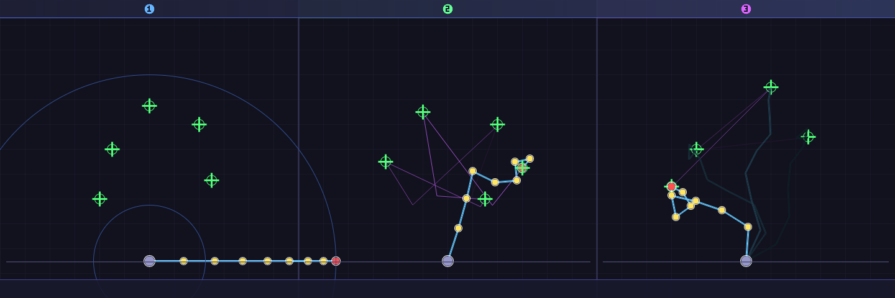

# Inverse Kinematics CCD Solver

Daily Coding Practice — 2026-04-16

## 简介

用 C++ 从零实现 **CCD（Cyclic Coordinate Descent）逆运动学求解器**，无任何外部依赖。

- **8 关节骨骼链**，总长约 300 像素
- **关节角度约束**（每关节独立 min/max）
- **多目标序列**：切换目标时自动从当前姿态继续求解
- **软光栅化可视化**：Wu 抗锯齿线、反走样圆形关节、末端轨迹
- **三列布局**：初始 T-Pose → CCD 迭代过程（轨迹） → 多目标收敛最终姿态

## 编译运行

```bash
g++ main.cpp -o output -std=c++17 -O2 -Wall -Wextra
./output
# 生成 ik_output.ppm，用 ImageMagick/PIL 转 PNG
```

## 输出结果



## 核心算法

```
CCD 单次迭代（从末端关节向根节点遍历）：
  for i = n-1 downto 0:
    toEnd    = normalize(endEffector - joint[i].pos)
    toTarget = normalize(target       - joint[i].pos)
    delta    = acos(dot(toEnd, toTarget)) * sign(cross(toEnd, toTarget))
    joint[i].angle += delta   // 应用角度约束后
```

## 技术要点

- CCD 算法：每次迭代从末端到根节点，旋转每个关节使末端更靠近目标
- 关节约束：`clamp(angle, minAngle, maxAngle)` 防止关节过度弯曲
- 收敛判定：末端与目标距离 < 1 像素即判为收敛
- 最大迭代次数：100~200 次，复杂姿态也能稳定收敛
- 正运动学（FK）：累积关节角度，依次计算各关节世界坐标
